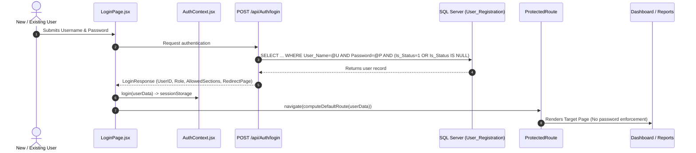

# First-Time Password Change & User Status Architecture Specification

## 1. Executive Summary & Objective

In the Vishal Mega Mart Dashboard system, when an administrator registers a new user (Store User, Store Admin, Warehouse Admin, etc.), a default password is assigned. To safeguard system integrity:
1. **New users must NOT access the dashboard** or any administrative features until they replace their initial default password with their own credentials.
2. Once the password is changed, the user's status must transition in the database so that **subsequent logins proceed directly to their target dashboard/page**.
3. After password change, administrators or third parties can no longer access the account using the default initial credentials.
4. Existing users who have already set their passwords can still change them voluntarily anytime via the Profile menu.

---

## 2. Database Schema & State Transitions

All credentials, access roles, and status flags are managed in **`dbo.User_Registration`**.

### Table Schema (`dbo.User_Registration`)

| Column Name | Data Type | Nullable | Default Value | Functional Role |
| :--- | :--- | :--- | :--- | :--- |
| **`User_ID`** | `int` | NO | *Identity* | Unique User Identifier |
| **`User_Name`** | `nvarchar(20)` | YES | *None* | Username / Login Handle |
| **`Password`** | `nvarchar(20)` | YES | *None* | User Password |
| **`User_Type`** | `nvarchar(20)` | YES | *None* | Role (`Super Admin`, `Store Admin`, `Warehouse Admin`, etc.) |
| **`Store_ID`** | `int` | YES | `NULL` | Assigned Store ID (if Store role) |
| **`WH_ID`** | `int` | YES | `NULL` | Assigned Warehouse ID (if Warehouse role) |
| **`Is_Status`** | `char(1)` | YES | **`'1'`** | **Account Active / Inactive Flag** (`1` = Active, `0` = Suspended/Inactive) |
| **`Is_Login_Status`** | `char(1)` | YES | **`'0'`** | **First-Time Password Change Flag** (`0` = Default pass, `1` = Password changed) |
| **`Entry_Date`** | `datetime` | YES | `GETDATE()` | Date/time the account was registered |
| **`Modify_Date`** | `datetime` | YES | `NULL` | Timestamp of latest credential/profile update |

---

### Key Distinction: `Is_Status` vs `Is_Login_Status`

| Scenario | `Is_Status` | `Is_Login_Status` | System Behavior |
| :--- | :---: | :---: | :--- |
| **Newly Created User** | **`'1'`** | **`'0'`** | Account is active, but **must change password** before accessing dashboard. |
| **Active Existing User** | **`'1'`** | **`'1'`** | Full access to permitted sections / dashboard directly. |
| **Deactivated User** | **`'0'`** | *Any* | Login blocked immediately (*"USER IS INACTIVE"*). |
| **Re-activated User** | **`'1'`** | **`'1'`** | Restored without forcing them to change an already-established password. |

> [!IMPORTANT]
> The database does **not** have automated triggers to change `Is_Login_Status` from `'0'` to `'1'`. This state transition is executed by the backend API when the user successfully changes their password.

---

## 3. Current System Audit & Architecture Gaps

### Current Auth Flow Diagram



### Identified Gaps:
1. **Backend Query Omission**: `AuthService.LoginAsync` does not query `u.Is_Login_Status`. As a result, the backend cannot inform the frontend that a user is logging in for the first time.
2. **Missing Flag in Login Payload**: `LoginResponse` does not include `RequirePasswordChange` or `IsLoginStatus`.
3. **Change Password Query Incomplete**: When `POST /api/Auth/change-password` executes, it updates `Password` and `Modify_Date`, but leaves `Is_Login_Status` untouched.
4. **Frontend Navigation Guard Absence**: `ProtectedRoute.jsx` checks only `isLoggedIn`; it does not check whether first-time password reset is pending.

---

## 4. Target Architecture & End-to-End Workflow

```mermaid
flowchart TD
    A([User Submits Credentials]) --> B[POST /api/Auth/login]
    B --> C{Credentials Valid & Is_Status == '1'?}
    C -- No --> D[Return Error: Invalid Credentials / Inactive]
    C -- Yes --> E{Is_Login_Status in DB}
    
    E -- "Is_Login_Status == '0' (New User)" --> F[Return RequirePasswordChange = true]
    E -- "Is_Login_Status == '1' (Existing)" --> G[Return RequirePasswordChange = false]
    
    G --> H[AuthContext stores session]
    H --> I[Navigate directly to computeDefaultRoute /dashboard]
    
    F --> J[AuthContext stores session with requirePasswordChange = true]
    J --> K[ProtectedRoute Interceptor activates]
    K --> L[Display Mandatory Change Password Screen / Modal]
    
    L --> M[User inputs Current Password + New Password twice]
    M --> N[POST /api/Auth/change-password]
    
    N --> O[(DB UPDATE: SET Password = @NewPass, Is_Login_Status = '1', Modify_Date = GETDATE())]
    O --> P[Backend returns Success]
    P --> Q[AuthContext: requirePasswordChange = false]
    Q --> I
```

---

## 5. Step-by-Step Implementation Blueprint

### Step 1: Backend DTOs (`Features/Auth/AuthModels.cs` or `LoginModels.cs`)

Update `LoginResponse` to expose the first-time login status:

```csharp
public class LoginResponse
{
    public bool Success { get; set; }
    public string Message { get; set; } = string.Empty;
    public string UserName { get; set; } = string.Empty;
    public string UserID { get; set; } = string.Empty;
    public string UserType { get; set; } = string.Empty;
    public string StoreName { get; set; } = string.Empty;
    public string StoreCode { get; set; } = string.Empty;
    public string WarehouseName { get; set; } = string.Empty;
    public string WarehouseCode { get; set; } = string.Empty;
    public List<string> AllowedSections { get; set; } = new();
    public string RedirectPage { get; set; } = "Dashboard";

    // New Fields for First-Time Setup
    public bool RequirePasswordChange { get; set; } = false;
    public string IsLoginStatus { get; set; } = "1";
}
```

---

### Step 2: Backend Authentication Service (`Features/Auth/AuthService.cs`)

#### 1. In `LoginAsync`:
Fetch `u.Is_Login_Status` and calculate `RequirePasswordChange`:

```csharp
const string loginSql = @"
SELECT TOP 1                                
    u.User_ID, 
    u.User_Name, 
    s.STORE_NAME, 
    wm.Wh_Name, 
    u.User_Type, 
    s.Store_Code, 
    wm.Wh_Code,
    u.Is_Login_Status,
    u.Is_Status
FROM dbo.User_Registration u WITH (NOLOCK) 
LEFT JOIN dbo.tbl_Store_Master s WITH (NOLOCK) ON u.Store_ID = s.Store_ID 
LEFT JOIN dbo.tbl_Warehouse_Mst wm WITH (NOLOCK) ON u.WH_ID = wm.WH_ID 
WHERE u.User_Name = @User_Name 
  AND (u.Password = @Password OR (u.User_Name = 'Admin' AND (@Password = '123' OR @Password = 'Admin@123')))
  AND (u.Is_Status = 1 OR u.Is_Status IS NULL);";
```

In the response mapping:
```csharp
string rawLoginStatus = row.ContainsKey("Is_Login_Status") && row["Is_Login_Status"] != null
    ? row["Is_Login_Status"].ToString()!.Trim()
    : "0";

bool requireChange = (rawLoginStatus == "0" || string.IsNullOrEmpty(rawLoginStatus));

var response = new LoginResponse
{
    // ... existing fields ...
    RequirePasswordChange = requireChange,
    IsLoginStatus = rawLoginStatus
};
```

#### 2. In `ChangePasswordAsync`:
Update `Is_Login_Status = '1'` when the password is changed:

```csharp
const string updateSql = @"
UPDATE dbo.User_Registration
SET Password = @NewPassword,
    Is_Login_Status = '1',
    Modify_Date = GETDATE()
WHERE (User_Name = @UserName OR (@UserId <> '' AND User_ID = @UserId))
  AND Password = @CurrentPassword
  AND (Is_Status = 1 OR Is_Status IS NULL);";
```

---

### Step 3: Frontend Session & Context (`src/context/AuthContext.jsx`)

1. **State Addition**:
   ```javascript
   const [requirePasswordChange, setRequirePasswordChange] = useState(false);
   ```
2. **Hydration from Session Storage**:
   ```javascript
   const parsed = JSON.parse(storedUser);
   setRequirePasswordChange(Boolean(parsed.requirePasswordChange ?? parsed.RequirePasswordChange));
   ```
3. **Login Action**:
   ```javascript
   const requireChange = Boolean(userData?.requirePasswordChange ?? userData?.RequirePasswordChange ?? (userData?.isLoginStatus === '0'));
   setRequirePasswordChange(requireChange);
   ```
4. **Flipping Status Post-Change**:
   Provide a helper method `markPasswordChanged()`:
   ```javascript
   const markPasswordChanged = () => {
     setRequirePasswordChange(false);
     const storedUser = sessionStorage.getItem('vmm_user');
     if (storedUser) {
       try {
         const parsed = JSON.parse(storedUser);
         parsed.requirePasswordChange = false;
         parsed.RequirePasswordChange = false;
         parsed.isLoginStatus = '1';
         parsed.IsLoginStatus = '1';
         sessionStorage.setItem('vmm_user', JSON.stringify(parsed));
       } catch (e) {
         // handle error
       }
     }
   };
   ```

---

### Step 4: Route Guard & Mandatory Interceptor (`src/components/common/ProtectedRoute.jsx`)

Ensure a new user cannot bypass the screen by typing `/dashboard` or `/reports/live-stock` directly in the URL bar:

```jsx
export default function ProtectedRoute({ children }) {
  const { isLoggedIn, requirePasswordChange, loggedInUser, markPasswordChanged } = useAuth();
  const location = useLocation();

  if (!isLoggedIn) {
    return <Navigate to="/login" state={{ from: location }} replace />;
  }

  // If initial password change is mandatory, force the Change Password Screen
  if (requirePasswordChange) {
    return (
      <MandatoryPasswordChangeScreen 
        userName={loggedInUser} 
        onSuccess={() => markPasswordChanged()} 
      />
    );
  }

  return children;
}
```

---

### Step 5: Voluntary Changes for Existing Users

- Existing users (`Is_Login_Status = '1'`) bypass the mandatory gate.
- They can change their password at any time via:
  1. Header Profile dropdown $\rightarrow$ **Change Password** ([Header.jsx](file:///c:/Users/asust/OneDrive/Documents/VMM%20Master%20Folder/Vishal-Mega-Mart-Dashboard-V2/src/components/layout/Header.jsx#L218-L222))
  2. [ChangePasswordModal.jsx](file:///c:/Users/asust/OneDrive/Documents/VMM%20Master%20Folder/Vishal-Mega-Mart-Dashboard-V2/src/components/modals/ChangePasswordModal.jsx) opens seamlessly without locking out navigation.

---

## 6. Verification & Test Matrix

| Test Case | Steps | Expected Result |
| :--- | :--- | :--- |
| **TC-01: Admin creates new user** | In User Registration, create user `test_store1` with pass `123`. | DB records: `Is_Status = 1`, `Is_Login_Status = 0`, `Modify_Date = NULL`. |
| **TC-02: New user first login** | Log in with `test_store1` / `123`. | User is immediately intercepted with Mandatory Change Password modal/screen. Dashboard is **not** rendered. |
| **TC-03: Attempt URL bypass** | While on password screen, manually navigate to `/dashboard` or `/reports/grc`. | ProtectedRoute blocks access and keeps user on Password Change screen. |
| **TC-04: Password change submission** | Enter old pass `123`, new pass `NewPass@2026` twice and submit. | DB updates: `Password = NewPass@2026`, `Is_Login_Status = 1`, `Modify_Date = GETDATE()`. User is redirected to `/dashboard`. |
| **TC-05: Subsequent login** | Log out, then log in with `test_store1` / `NewPass@2026`. | Directly navigates to dashboard with no password modal. |
| **TC-06: Admin old credentials lockout** | Attempt login with old password `123`. | Authentication rejected (`Invalid username or password`). |
| **TC-07: Existing user voluntary change** | User opens Profile Menu $\rightarrow$ "Change Password". | Change Password modal opens and updates credentials smoothly. |
