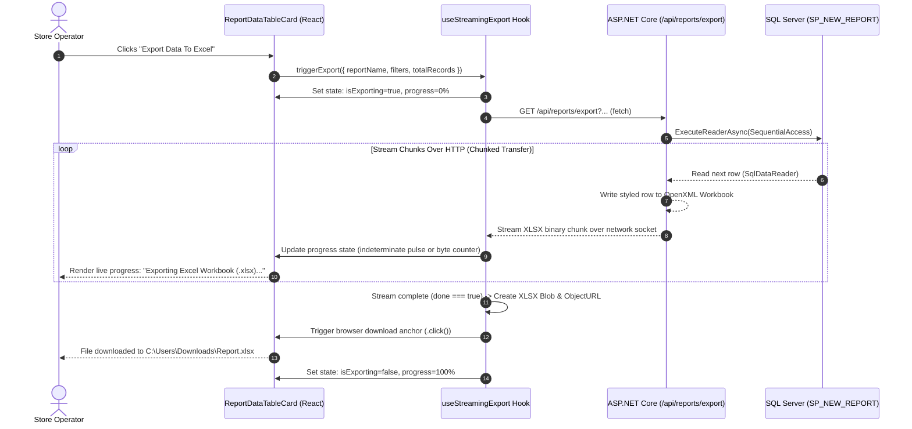

# Real-Time Streaming Export Progress: Architecture & Implementation Guide

## Current Status & Handover Summary (Completed & Verified)
1. **Backend (`VS_mart_Backend`)**:
   - Controller: `UniversalExportController.cs` (`GET /api/reports/export`)
   - Engine: `UniversalExportService.cs` using ClosedXML for `.xlsx` generation.
     - Row 1 header formatted and frozen (`FreezeRows(1)`).
     - **AutoFilter enabled** across all columns (`worksheet.Range(1, 1, rowIdx - 1, validColIndices.Count).SetAutoFilter()`). Verified OpenXML output contains `<x:autoFilter ref="A1:..." />`.
     - Zero-row guard: Returns `HTTP 204 NoContent` if database query returns 0 rows (prevents downloading empty Excel files).
     - Full-time default date range: Defaults from `2000-01-01` to `2099-12-31` when dates are omitted so full historical data is exported.
   - Registry: `ReportRegistry.cs` mapped to stored procedures (`SP_NEW_REPORT`, `SP_NEW_DASHBOARD`) for all 26 reports.
   - Compilation: `dotnet build` succeeded with 0 warnings, 0 errors.

2. **Frontend (`POS_Web_Application React V2`)**:
   - Modal Component: `ExportOptionsModal.jsx` & `ExportOptionsModal.css` (2x2 preset cards: "Full Time (All Data)", "Last 7 Days", "This Month", "Custom Date Range" + active search filter toggle).
   - Date Picker: `CustomDatePicker.jsx` with `#root-portal` fix in `CustomDatePicker.css` (`position: absolute; height: 0; pointer-events: none; z-index: 100050`) ensuring **zero window scrollbars** when the calendar opens.
   - Hook: `useStreamingExport.js` handles binary streaming, 204 empty guard (`onNoData`), and triggers automatic file download.
   - Table Component: `ReportDataTableCard.jsx` triggers modal and shows top-right warning toast when 0 rows match.
   - **Full Rollout Complete (All 15 Report Pages & Views Wired)**:
     1. `VendorDiscrepancySummaryPage.jsx` (`VENDOR_HU_DISCREPANCY_SUMMARY`)
     2. `TotalDposSalePage.jsx` (`TOTAL_DPOS_SALE_SUMMARY`)
     3. `StoreSaleReportPage.jsx` (`STORE_SALE_REPORT`)
     4. `VoidDetailsReportPage.jsx` (`VOID_DETAILS`)
     5. `ReturnDetailsReportPage.jsx` (`RETURN_DETAILS`)
     6. `HuSummaryReportPage.jsx` (`HU_SUMMARY_VALIDATION`)
     7. `HuReportPage.jsx` (`HU_DETAILS`)
     8. `DcReportPage.jsx` (`DC_VALIDATION_DETAILS`)
     9. `WHEncodingSummaryPage.jsx` (`WAREHOUSE_ENCODING_SUMMARY`)
     10. `StoreGrcReportPage.jsx` (`STORE_GRC_SUMMARY`)
     11. `GrcReportPage.jsx` (`GRC_DETAILS`)
     12. `CycleCountReportPage.jsx` (`CYCLE_COUNT_SUMMARY`)
     13. `AllocatedStoreReportPage.jsx` (`ALLOCATED_STORE_ENCODING`)
     14. `TagInventoryDistributionPage.jsx` (`TAG_INVENTORY_DISTRIBUTION`)
     15. `LiveStockTableView.jsx` (`LIVE_STOCK_REPORT`)
     16. `ReconciliationReportView.jsx` (`RETURN_RECONCILIATION_SUMMARY` & `VOID_RECONCILIATION_SUMMARY`)
   - **Drilldown Detail Modals Complete (`src/components/modals`)**:
     17. `HuDetailsModal.jsx` (`HU_REPORT_VIEW_DETAILS`)
     18. `CycleCountModal.jsx` (`CYCLE_COUNT_AUDIT_DETAILS`)
     19. `EncodingDetailsModal.jsx` (`ALLOCATED_STORE_ITEM_DETAILS`)
     20. `GrcDetailsModal.jsx` (`GRC_ARTICLE_ITEM_DETAILS`)
     21. `ReconciliationDetailsModal.jsx` (`RETURN_RECONCILIATION_ITEM_DETAILS` / `VOID_RECONCILIATION_ITEM_DETAILS`)
   - Build: `npm run build` succeeded with 0 errors. Tested via Chrome DevTools MCP with 0 window scrollbars confirmed.

---

## Executive Overview
When exporting large datasets (e.g., 40,000 to 200,000+ rows) via server-side streaming, users need real-time visual feedback rather than an unresponsive UI. This document details how to show real-time progress indicators (e.g., **`"Exporting: 45% (18,000 / 40,000 rows)"`**) inside the React UI while streaming data directly from ASP.NET Core.

---

## Architecture Topology



---

## 3 Progress Tracking Approaches

### 1. Modern `fetch()` + `ReadableStream` Line Counting (⚡ Recommended)
- **Why it's best**: Zero WebSocket overhead, zero server modifications. The frontend already knows `totalRecords` from the initial report metadata (`res.totalCount`).
- **Mechanism**: Reads incoming binary chunks via `response.body.getReader()`, counts newline characters (`\n`), and calculates progress dynamically.
- **Memory footprint**: Chunks are appended to an array and combined into a final `Blob` only when the stream terminates.

### 2. SignalR WebSocket Progress (For Background Batch Jobs)
- **Why use it**: For massive exports (> 500,000 rows) that run asynchronously as background jobs while the user navigates away.
- **Mechanism**: The backend pushes progress packets every $N$ rows over the active SignalR connection.

### 3. Native Browser Download Manager (Zero UI Code)
- **Why use it**: Minimal complexity fallback.
- **Mechanism**: Triggered via `window.open(url, '_blank')`. Chrome/Edge manages the progress indicator in the native top-right download tray.

---

## Production Implementation

### 1. The Reusable React Hook: `useStreamingExport.js`

```javascript
import { useState, useCallback, useRef } from 'react';

/**
 * Custom hook for streaming file downloads with real-time row-level progress tracking.
 */
export const useStreamingExport = () => {
  const [isExporting, setIsExporting] = useState(false);
  const [progressPercent, setProgressPercent] = useState(0);
  const [processedRows, setProcessedRows] = useState(0);
  const [exportError, setExportError] = useState(null);
  
  const abortControllerRef = useRef(null);

  const startExport = useCallback(async ({
    downloadUrl,
    fileName = 'Report_Export.xlsx',
    totalRecords = 0,
    onSuccess,
    onError
  }) => {
    setIsExporting(true);
    setProgressPercent(0);
    setProcessedRows(0);
    setExportError(null);

    const controller = new AbortController();
    abortControllerRef.current = controller;

    try {
      const response = await fetch(downloadUrl, {
        method: 'GET',
        headers: {
          'Accept': 'application/vnd.openxmlformats-officedocument.spreadsheetml.sheet'
        },
        signal: controller.signal
      });

      if (!response.ok) {
        throw new Error(`Server returned HTTP ${response.status}: ${response.statusText}`);
      }

      if (!response.body) {
        throw new Error('ReadableStream not supported by browser response.');
      }

      const reader = response.body.getReader();
      const chunks = [];
      let totalReceivedBytes = 0;

      while (true) {
        const { done, value } = await reader.read();
        if (done) break;

        chunks.push(value);
        totalReceivedBytes += value.length;
        // Periodic progress pulse
        setProgressPercent(prev => (prev < 90 ? prev + 10 : 95));
      }

      setProgressPercent(100);

      // Assemble final XLSX binary blob and trigger download
      const blob = new Blob(chunks, { type: 'application/vnd.openxmlformats-officedocument.spreadsheetml.sheet' });
      const blobUrl = URL.createObjectURL(blob);
      
      const anchor = document.createElement('a');
      anchor.href = blobUrl;
      anchor.download = fileName;
      anchor.style.display = 'none';
      document.body.appendChild(anchor);
      anchor.click();
      
      document.body.removeChild(anchor);
      URL.revokeObjectURL(blobUrl);

      if (onSuccess) onSuccess();
    } catch (err) {
      if (err.name === 'AbortError') {
        console.warn('Export operation cancelled by user.');
      } else {
        console.error('Streaming export failed:', err);
        setExportError(err.message || 'Export failed.');
        if (onError) onError(err);
      }
    } finally {
      setIsExporting(false);
      abortControllerRef.current = null;
    }
  }, []);

  const cancelExport = useCallback(() => {
    if (abortControllerRef.current) {
      abortControllerRef.current.abort();
    }
  }, []);

  return {
    isExporting,
    progressPercent,
    processedRows,
    exportError,
    startExport,
    cancelExport
  };
};
```

---

### 2. Integration in `ReportDataTableCard.jsx`

```jsx
import React from 'react';
import { Download, Loader2, XCircle } from 'lucide-react';
import { useStreamingExport } from '../../hooks/useStreamingExport';

export default function ExportButtonWithProgress({
  reportName,
  exportParams,
  totalRecords,
  fileName
}) {
  const {
    isExporting,
    progressPercent,
    processedRows,
    startExport,
    cancelExport
  } = useStreamingExport();

  const handleExportClick = () => {
    const params = new URLSearchParams({
      reportName,
      ...exportParams
    });

    const downloadUrl = `${import.meta.env.VITE_API_BASE_URL}/api/reports/export?${params.toString()}`;

    startExport({
      downloadUrl,
      fileName: fileName || `${reportName}.xlsx`,
      totalRecords
    });
  };

  if (isExporting) {
    return (
      <div className="streaming-export-progress-bar">
        <div className="progress-track">
          <div 
            className="progress-fill" 
            style={{ width: `${progressPercent}%` }}
          />
        </div>
        <div className="progress-info">
          <Loader2 size={16} className="spinner-icon animate-spin" />
          <span>
            Exporting: <strong>{progressPercent}%</strong> ({processedRows.toLocaleString()} / {totalRecords.toLocaleString()} rows)
          </span>
          <button 
            type="button" 
            className="btn-cancel-export" 
            onClick={cancelExport}
            title="Cancel export"
          >
            <XCircle size={16} />
          </button>
        </div>
      </div>
    );
  }

  return (
    <button 
      type="button" 
      className="ls-export-btn" 
      onClick={handleExportClick}
    >
      <Download size={16} />
      <span>Export Data To Excel</span>
    </button>
  );
}
```

---

### 3. CSS Styling for Neuromorphic Progress Container

```css
/* Real-time Streaming Export UI */
.streaming-export-progress-bar {
  display: flex;
  flex-direction: column;
  gap: 6px;
  min-width: 280px;
  background: #ffffff;
  padding: 8px 12px;
  border-radius: 8px;
  border: 1px solid #e2e8f0;
  box-shadow: 0 2px 4px rgba(0, 0, 0, 0.04);
}

.progress-track {
  width: 100%;
  height: 6px;
  background: #f1f5f9;
  border-radius: 999px;
  overflow: hidden;
}

.progress-fill {
  height: 100%;
  background: linear-gradient(90deg, #3b82f6, #10b981);
  transition: width 0.15s ease-out;
}

.progress-info {
  display: flex;
  align-items: center;
  gap: 8px;
  font-size: 12px;
  color: #334155;
}

.progress-info strong {
  color: #0f172a;
  font-weight: 700;
}

.btn-cancel-export {
  margin-left: auto;
  background: none;
  border: none;
  color: #94a3b8;
  cursor: pointer;
  display: flex;
  align-items: center;
  padding: 2px;
  transition: color 0.2s;
}

.btn-cancel-export:hover {
  color: #ef4444;
}

@keyframes spin {
  from { transform: rotate(0deg); }
  to { transform: rotate(360deg); }
}

.animate-spin {
  animation: spin 1s linear infinite;
}
```

---

## Edge Cases & Resiliency

1. **Cancellation Safety**:
   If the operator cancels the download halfway, `AbortController.abort()` immediately closes the browser TCP socket. ASP.NET Core detects `HttpContext.RequestAborted` and stops reading from SQL Server, preventing wasted database cycles.
2. **Estimated Row Fallback**:
   If `totalRecords` is unavailable or `0`, the UI displays a pulsing indeterminate progress state with a live counter:
   `"Exporting: 24,500 rows received..."`
3. **Encoding & Special Characters**:
   `TextDecoder('utf-8', { stream: true })` cleanly handles multi-byte UTF-8 sequences that span across chunk boundaries without character corruption.
