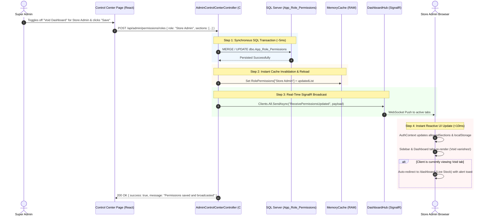

# 🎛️ Super Admin Access Control Center & Dynamic Permissions Architecture

> **Document Version**: 1.0.0  
> **Target Date**: Next Session Execution  
> **Database**: `VMM_RFID_RETAIL_SOLUTION` (SQL Server)  
> **Backend**: ASP.NET Core 8 Web API (`VS_mart_Backend`)  
> **Frontend**: React 18 SPA (`POS_Web_Application React V2`)  
> **Real-Time Engine**: SignalR Core (`DashboardHub` / `/hubs/dashboard`)  

---

## 📑 Table of Contents
1. [Executive Summary & Objectives](#1-executive-summary--objectives)
2. [Current Architecture & Audit Gaps](#2-current-architecture--audit-gaps)
3. [End-to-End System Architecture & Data Flow](#3-end-to-end-system-architecture--data-flow)
4. [Zero-Drift Refresh Guarantee](#4-zero-drift-refresh-guarantee)
5. [Database Schema & Seed Scripts (SQL Server)](#5-database-schema--seed-scripts)
6. [Inventory of Controlled Sections & Menus](#6-inventory-of-controlled-sections--menus)
7. [Backend Implementation Specifications](#7-backend-implementation-specifications)
8. [SignalR Real-Time Micro-Sync Specification](#8-signalr-real-time-micro-sync-specification)
9. [Frontend Implementation Specifications](#9-frontend-implementation-specifications)
10. [Store Disable Notification Integration (Phase 2 Preview)](#10-store-disable-notification-integration)
11. [Tomorrow's Step-by-Step Execution Plan](#11-tomorrows-step-by-step-execution-plan)

---

## 1. Executive Summary & Objectives

The goal of this initiative is to eliminate hardcoded permission arrays in the application and provide a centralized, interactive **Super Admin Access Control Center**. 

### Primary Objectives:
1. **Dynamic Section Control**: Allow Super Admin to toggle any Dashboard tab, Sidebar report, or Registration master for any Role (or specific User) via an intuitive Web UI.
2. **Permanent Database Persistence**: Ensure all permission modifications are saved directly to SQL Server so they **never reset or vanish** upon server restarts, IIS worker-process recycles, or backend deployments.
3. **Instant Real-Time UI Sync (< 15ms)**: Reuse the existing open Dashboard WebSocket (`/hubs/dashboard`) to broadcast permission updates directly to active user screens, instantly removing revoked tabs/sidebar items without requiring a page reload.
4. **Zero-Drift Refresh Integrity**: Guarantee that when a user refreshes the browser (F5) immediately after a permission update, the revoked options **remain hidden** and never "ghost" back.

---

## 2. Current Architecture & Audit Gaps

### How It Works Today:
* **Data-Level Filtering (Which store data is visible)**:
  * [BaseDashboardService.cs](file:///c:/Users/MARKSS/OneDrive/Documents/VMM%20Master%20Folder/VS_mart_Backend/VS%20Mart%20Backend/VS%20Mart%20Backend/Features/Dashboard/Base/BaseDashboardService.cs#L213-L253) (`GetUserProfileAsync`) reads `dbo.User_Registration` joined with `dbo.tbl_Store_Master` to fetch `StoreCode`.
  * [MainDashboardService.cs](file:///c:/Users/MARKSS/OneDrive/Documents/VMM%20Master%20Folder/VS_mart_Backend/VS%20Mart%20Backend/VS%20Mart%20Backend/Features/Dashboard/MainDashboard/MainDashboardService.cs#L80-L135) maintains company-wide data in RAM via Super Admin master cache keys (`LiveStockDetails_Master_...`). If `profile.StoreCode` is set, it slices the master array in RAM (`x => MatchStore(x, profile.StoreCode)`).
* **UI-Level Permissions (Which tabs and sidebar links appear)**:
  * **Hardcoded in C#**: [AuthService.cs](file:///c:/Users/MARKSS/OneDrive/Documents/VMM%20Master%20Folder/VS_mart_Backend/VS%20Mart%20Backend/VS%20Mart%20Backend/Features/Auth/AuthService.cs#L74-L135) contains a static `switch (normalizedRole)` statement that builds the `allowedSections` string array.
  * **Hardcoded in React**: [AuthContext.jsx](file:///c:/Users/MARKSS/OneDrive/Documents/VMM%20Master%20Folder/POS_Web_Application%20React%20V2/src/context/AuthContext.jsx#L219-L253) has duplicate fallback switch statements for `hasSection(...)`.

### The Critical Gap:
Because there is **no database table** storing which role or user has access to which section, changing access currently requires modifying C# and React code, re-compiling, and redeploying. If stored in an in-memory variable without a SQL table, all customizations would be lost on the first server restart.

---

## 3. End-to-End System Architecture & Data Flow



---

## 4. Zero-Drift Refresh Guarantee

### The Risk Addressed:
If a user's screen receives a WebSocket disable event, but then the user refreshes the browser (F5), a poorly designed system might query a stale database cache and restore the disabled menu item, confusing the user.

### Our 3-Layer Zero-Drift Protection:
1. **Synchronous DB Commit Before Ack**: The backend writes to SQL Server *before* sending the WebSocket payload or returning HTTP 200.
2. **Immediate RAM Cache Update**: The backend's `IMemoryCache` is refreshed in the exact same execution thread. Any API request hitting the backend 1 millisecond later gets the new data.
3. **Synchronous Frontend `localStorage` Write**: When [`AuthContext.jsx`](file:///c:/Users/MARKSS/OneDrive/Documents/VMM%20Master%20Folder/POS_Web_Application%20React%20V2/src/context/AuthContext.jsx) receives the WebSocket event, it updates `localStorage.setItem('user', ...)` synchronously before React renders. When F5 is pressed, React initial state loads from `localStorage` where the item is already removed.

---

## 5. Database Schema & Seed Scripts

Run this SQL migration script in SQL Server Management Studio against `VMM_RFID_RETAIL_SOLUTION`:

```sql
-- =========================================================================
-- Migration: Create Dynamic Role and User Permission Management Tables
-- Database: VMM_RFID_RETAIL_SOLUTION
-- =========================================================================

-- 1. Create Role-Level Permissions Table
IF NOT EXISTS (SELECT * FROM sys.tables WHERE name = 'App_Role_Permissions')
BEGIN
    CREATE TABLE dbo.App_Role_Permissions (
        Role_Name NVARCHAR(50) NOT NULL,
        Section_Key NVARCHAR(50) NOT NULL,
        Is_Allowed BIT NOT NULL DEFAULT 1,
        Updated_By NVARCHAR(50) NULL,
        Updated_Date DATETIME NOT NULL DEFAULT GETDATE(),
        CONSTRAINT PK_App_Role_Permissions PRIMARY KEY CLUSTERED (Role_Name, Section_Key)
    );
    CREATE NONCLUSTERED INDEX IX_App_Role_Permissions_Role ON dbo.App_Role_Permissions (Role_Name, Is_Allowed);
END;

-- 2. Create User-Specific Overrides Table (Optional fine-grained control per user)
IF NOT EXISTS (SELECT * FROM sys.tables WHERE name = 'App_User_Permissions')
BEGIN
    CREATE TABLE dbo.App_User_Permissions (
        User_ID INT NOT NULL,
        Section_Key NVARCHAR(50) NOT NULL,
        Is_Allowed BIT NOT NULL DEFAULT 1,
        Updated_By NVARCHAR(50) NULL,
        Updated_Date DATETIME NOT NULL DEFAULT GETDATE(),
        CONSTRAINT PK_App_User_Permissions PRIMARY KEY CLUSTERED (User_ID, Section_Key),
        CONSTRAINT FK_App_User_Permissions_User FOREIGN KEY (User_ID) REFERENCES dbo.User_Registration (User_ID) ON DELETE CASCADE
    );
    CREATE NONCLUSTERED INDEX IX_App_User_Permissions_User ON dbo.App_User_Permissions (User_ID, Is_Allowed);
END;

-- 3. Seed Default Permissions from current AuthService hardcoded rules
-- (Only inserts if table is empty, preserving future admin changes)
IF NOT EXISTS (SELECT 1 FROM dbo.App_Role_Permissions)
BEGIN
    -- Super Admin (Full access to all standard sections)
    INSERT INTO dbo.App_Role_Permissions (Role_Name, Section_Key, Is_Allowed) VALUES
    ('Super Admin', 'live_stock', 1),
    ('Super Admin', 'cycle_count', 1),
    ('Super Admin', 'store_validation', 1),
    ('Super Admin', 'sale', 1),
    ('Super Admin', 'void', 1),
    ('Super Admin', 'return', 1),
    ('Super Admin', 'store_counter_status', 1),
    ('Super Admin', 'get_sap_stock_take', 1),
    ('Super Admin', 'dc_validation', 1),
    ('Super Admin', 'dc_encoding', 1),
    ('Super Admin', 'tag_management', 1),
    ('Super Admin', 'vendor_discrepancy', 1),
    ('Super Admin', 'user_registration', 1),
    ('Super Admin', 'store_registration', 1),
    ('Super Admin', 'warehouse_registration', 1),
    ('Super Admin', 'floor_registration', 1),
    ('Super Admin', 'tag_cleaning', 1);

    -- Store Admin
    INSERT INTO dbo.App_Role_Permissions (Role_Name, Section_Key, Is_Allowed) VALUES
    ('Store Admin', 'live_stock', 1),
    ('Store Admin', 'cycle_count', 1),
    ('Store Admin', 'store_validation', 1),
    ('Store Admin', 'sale', 1),
    ('Store Admin', 'void', 1),
    ('Store Admin', 'return', 1),
    ('Store Admin', 'store_counter_status', 1),
    ('Store Admin', 'get_sap_stock_take', 1),
    ('Store Admin', 'user_registration', 1);

    -- Store User / Store
    INSERT INTO dbo.App_Role_Permissions (Role_Name, Section_Key, Is_Allowed) VALUES
    ('Store User', 'live_stock', 1),
    ('Store User', 'cycle_count', 1),
    ('Store User', 'store_validation', 1),
    ('Store User', 'sale', 1),
    ('Store User', 'void', 1),
    ('Store User', 'return', 1),
    ('Store User', 'store_counter_status', 1),
    ('Store', 'live_stock', 1),
    ('Store', 'cycle_count', 1),
    ('Store', 'store_validation', 1),
    ('Store', 'sale', 1),
    ('Store', 'void', 1),
    ('Store', 'return', 1),
    ('Store', 'store_counter_status', 1);

    -- Warehouse Admin
    INSERT INTO dbo.App_Role_Permissions (Role_Name, Section_Key, Is_Allowed) VALUES
    ('Warehouse Admin', 'dc_validation', 1),
    ('Warehouse Admin', 'dc_encoding', 1),
    ('Warehouse Admin', 'tag_management', 1),
    ('Warehouse Admin', 'vendor_discrepancy', 1),
    ('Warehouse Admin', 'user_registration', 1);

    -- Warehouse User
    INSERT INTO dbo.App_Role_Permissions (Role_Name, Section_Key, Is_Allowed) VALUES
    ('Warehouse User', 'dc_validation', 1),
    ('Warehouse User', 'dc_encoding', 1),
    ('Warehouse', 'dc_validation', 1),
    ('Warehouse', 'dc_encoding', 1);

    -- Dispatch Admin
    INSERT INTO dbo.App_Role_Permissions (Role_Name, Section_Key, Is_Allowed) VALUES
    ('Dispatch Admin', 'dispatch_tracking', 1),
    ('Dispatch Admin', 'picklist_creation', 1);

    -- Tag Admin
    INSERT INTO dbo.App_Role_Permissions (Role_Name, Section_Key, Is_Allowed) VALUES
    ('Tag Admin', 'tag_cleaning', 1),
    ('Tag Admin', 'get_sap_stock_take', 1);
END;
```

---

## 6. Inventory of Controlled Sections & Menus

The Super Admin Control Center UI groups all permissions into **3 Clear Categories**:

| Category | Section Key | UI Display Name | Destination / Route | Component |
| :--- | :--- | :--- | :--- | :--- |
| **📊 Dashboard Tabs** | `live_stock` | Live Stock Dashboard | `/dashboard` (Tab 1) | `LiveStockTab` |
| | `cycle_count` | Tag Cycle Count | `/dashboard` (Tab 2) | `CycleCountTab` |
| | `store_validation` | Store Discrepancy | `/dashboard` (Tab 3) | `StoreValidationTab` |
| | `sale` | Sale Dashboard | `/dashboard` (Tab 4) | `SaleTab` |
| | `void` | Void Dashboard | `/dashboard` (Tab 5) | `VoidTab` |
| | `return` | Return Dashboard | `/dashboard` (Tab 6) | `ReturnTab` |
| | `dc_validation` | DC Validation | `/dashboard` (Tab 7) | `DcValidationTab` |
| | `dc_encoding` | DC Encoding | `/dashboard` (Tab 8) | `DcEncodingTab` |
| | `tag_management` | Tag Management | `/dashboard` (Tab 9) | `TagManagementTab` |
| | `vendor_discrepancy` | Vendor Discrepancy | `/dashboard` (Tab 10) | `VendorDiscrepancyTab` |
| **📑 Sidebar Reports & Tools** | `store_counter_status` | Store Counter Status | `/store/counter-status` | `StoreCounterStatusPage` |
| | `tag_cleaning` | Tag Cleaning Report | `/reports/tag-cleaning` | `TagCleaningReportPage` |
| | `get_sap_stock_take` | SAP Stock Take Report | `/reports/stock-take` | `SapStockTakePage` |
| | `dispatch_tracking` | Dispatch Tracking | `/dispatch/tracking` | `DispatchTrackingPage` |
| | `picklist_creation` | Picklist Creation | `/dispatch/picklist` | `PicklistCreationPage` |
| **⚙️ Master Registrations** | `user_registration` | User Registration | `/auth/user-registration` | `UserRegistrationPage` |
| | `store_registration` | Store Registration | `/auth/store-registration` | `StoreRegistrationPage` |
| | `floor_registration` | Floor Registration | `/auth/floor-registration` | `FloorRegistrationPage` |
| | `warehouse_registration` | Warehouse Registration | `/auth/warehouse-registration` | `WarehouseRegistrationPage` |

---

## 7. Backend Implementation Specifications

### 7.1 New Service: `IControlCenterService` & `ControlCenterService`
* **File Location**: `Features/AdminControlCenter/ControlCenterService.cs`
* **Core Methods**:
  * `Task<List<RolePermissionDto>> GetAllRolePermissionsAsync()`
  * `Task<List<string>> GetAllowedSectionsForRoleAsync(string roleName)`
  * `Task<List<string>> GetAllowedSectionsForUserAsync(int userId, string roleName)`
  * `Task<bool> SaveRolePermissionsAsync(string roleName, List<string> allowedSections, string updatedBy)`
  * `Task<bool> SaveUserPermissionOverridesAsync(int userId, List<string> allowedSections, string updatedBy)`
* **Caching Strategy**:
  * Cache key: `Permissions_Role_{roleName}` (Sliding expiration 120 mins)
  * Cache key: `Permissions_User_{userId}` (Sliding expiration 120 mins)
  * Invalidation: Whenever `SaveRolePermissionsAsync` or `SaveUserPermissionOverridesAsync` executes, the corresponding cache key is removed and re-seeded.

### 7.2 Updated Login Flow in `AuthService.cs`
* Replace the hardcoded `switch (normalizedRole)` with:
  ```csharp
  var allowedSections = await _controlCenterService.GetAllowedSectionsForUserAsync(userId, userType);
  ```
* Seamless fallback: If the database table is unreachable or empty, it falls back to default role arrays.

### 7.3 New Controller: `AdminControlCenterController.cs`
* **Route**: `/api/admin/control-center`
* **Security**: `[Authorize]` requiring `User_Type = 'Super Admin'`
* **Endpoints**:
  * `GET /api/admin/control-center/roles`: Returns all roles and current allowed section keys.
  * `POST /api/admin/control-center/roles`: Saves role permissions, updates RAM cache, and broadcasts SignalR event.
  * `GET /api/admin/control-center/users/{userId}`: Returns inherited role permissions vs. user overrides.
  * `POST /api/admin/control-center/users/{userId}`: Saves per-user overrides.

---

## 8. SignalR Real-Time Micro-Sync Specification

### 8.1 Backend Broadcast Method in `DashboardHub.cs`
Extend [`DashboardHub.cs`](file:///c:/Users/MARKSS/OneDrive/Documents/VMM%20Master%20Folder/VS_mart_Backend/VS%20Mart%20Backend/VS%20Mart%20Backend/Features/Dashboard/Hubs/DashboardHub.cs):
```csharp
public async Task BroadcastPermissionsUpdated(PermissionUpdatePayload payload)
{
    await Clients.All.SendAsync("ReceivePermissionsUpdated", payload);
}
```

### 8.2 Payload Structure:
```json
{
  "targetType": "Role",
  "targetName": "Store Admin",
  "allowedSections": [
    "live_stock",
    "cycle_count",
    "store_validation",
    "sale",
    "return"
  ],
  "timestamp": "2026-10-09T09:30:00Z"
}
```

### 8.3 Frontend Listener in `liveStockSocket.js`
Extend [`liveStockSocket.js`](file:///c:/Users/MARKSS/OneDrive/Documents/VMM%20Master%20Folder/POS_Web_Application%20React%20V2/src/services/liveStockSocket.js#L108-L140):
```javascript
// Register permissions listener
this.connection.on('ReceivePermissionsUpdated', (payload) => {
  this.dispatch(this.permissionListeners, payload, 'Permissions');
});
```

### 8.4 Reactive Handler in `AuthContext.jsx`
* When `ReceivePermissionsUpdated` arrives:
  1. Check if `payload.targetType === 'Role' && payload.targetName === userRole` OR `payload.targetType === 'User' && payload.targetName == userId`.
  2. If matched:
     * Call `setAllowedSections(payload.allowedSections)`.
     * Update `localStorage.getItem('user')` with new `allowedSections`.
     * Verify if `location.pathname` or active dashboard tab is still permitted. If not, trigger:
       `navigate(getDefaultRoute())` and display toast: *"Your access permissions were updated by the Administrator."*

---

## 9. Frontend Implementation Specifications

### 9.1 Control Center Page: `SuperAdminControlCenter.jsx`
* **Route**: `/admin/control-center`
* **Sidebar Placement**: Visible under **Administration** -> **Control Center** (Super Admin only).
* **UI Features**:
  1. **Role Selector Header**: Segmented tabs or pill buttons (`Store Admin`, `Store User`, `Warehouse Admin`, `Warehouse User`, `Tag Admin`, `Dispatch Admin`).
  2. **Categorized Permission Cards**:
     * Grid layout with high-contrast switch toggles (`#10B981` active / `#EF5350` inactive).
     * Group 1: Dashboard Modules (10 toggles)
     * Group 2: Operational Reports & Tools (5 toggles)
     * Group 3: System Masters (4 toggles)
  3. **"Save & Apply Globally" Action Bar**:
     * Floating sticky footer or top action bar.
     * Click triggers Confirmation Modal -> Sends POST request -> Triggers live SignalR push.
     * Shows feedback toast on success.
  4. **User Override Search Tab**:
     * Searchable user dropdown.
     * Toggle to "Enable custom overrides for this user" or "Inherit from Role".

---

## 10. Store Disable Notification Integration (Phase 2 Preview)

As discussed, the same SignalR WebSocket pipeline will power the store notification system:
1. When Super Admin or Store Admin toggles a store inactive in `StoreRegistrationPage.jsx`:
   * Backend executes status update in SQL.
   * Backend fires `ReceiveStoreStatusChanged` on `DashboardHub` with `{ storeCode: "1001", storeName: "VS Mart Store 1", isActive: false }`.
2. Clients subscribed to that store (or whose `profile.StoreCode == storeCode`) receive the event:
   * Displays an immediate warning notification: *"Store 1001 (VS Mart Store 1) has been deactivated."*
   * Automatically dims or hides data for that store.

---

## 11. Tomorrow's Step-by-Step Execution Plan

When resuming tomorrow, execute in this precise order:

### Phase 1: Database Setup
1. Execute the SQL migration script from [Section 5](#5-database-schema--seed-scripts) in SQL Server to create `App_Role_Permissions`, `App_User_Permissions`, and seed initial data.

### Phase 2: Backend API & WebSocket
2. Create `ControlCenterModels.cs`, `IControlCenterService.cs`, and `ControlCenterService.cs` in `VS_mart_Backend`.
3. Add `ReceivePermissionsUpdated` broadcast method in `DashboardHub.cs`.
4. Create `AdminControlCenterController.cs` exposing GET & POST endpoints for role and user permissions.
5. Update `AuthService.cs` login to read from `ControlCenterService` instead of hardcoded switch.

### Phase 3: Frontend UI & Real-Time Sync
6. Extend `liveStockSocket.js` with `onPermissionsUpdated` callback listener.
7. Update `AuthContext.jsx` to handle live updates, synchronize `localStorage`, and auto-evict users from revoked routes.
8. Create `SuperAdminControlCenter.jsx` with category cards, toggle switches, and save confirmation dialog.
9. Register route `/admin/control-center` in `App.jsx` and add sidebar navigation link in `Sidebar.jsx`.

### Phase 4: Validation & Live Testing
10. Log in with Super Admin in one browser window and Store Admin (`HD55`) in an incognito window.
11. Toggle off a tab (e.g. `Void`) for Store Admin and click "Save".
12. Verify the tab vanishes from `HD55`'s screen in real time (<15ms).
13. Refresh `HD55`'s browser (F5) and verify Void does **not** reappear (Zero-Drift verification).
14. Toggle it back on and verify it instantly reappears.
