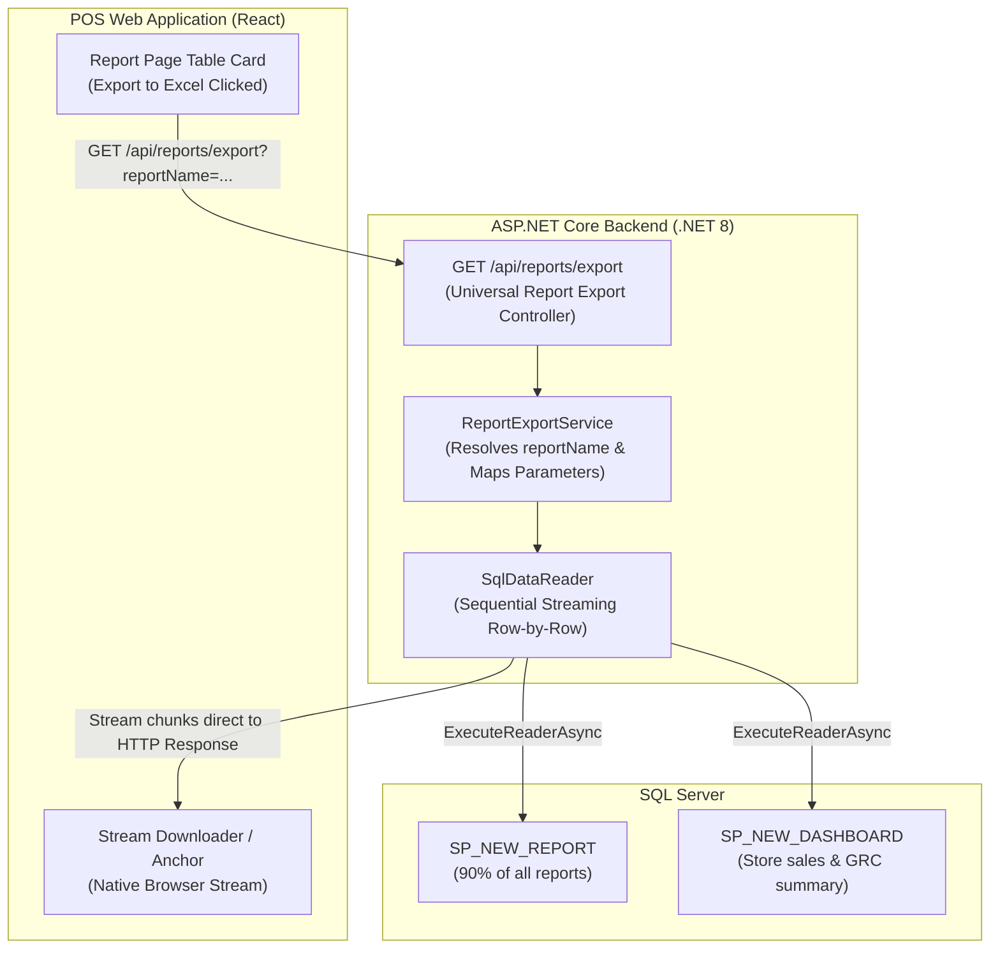

# Universal Report Export Mapping & Architecture Specification

## Overview
This document specifies the architecture, unique `reportName` keys, parameters, and Stored Procedure mappings for the **Universal Server-Side Excel Export Engine** in VMM POS.

Instead of developing 23 distinct export endpoints, the backend exposes **one single streaming endpoint**:
```http
GET /api/reports/export
```
This endpoint streams report data directly from SQL Server to the browser as a downloadable native **`.xlsx` Excel file** (OpenXML format with styled headers and cell types), preventing browser crashes, memory exhaustion, and HTTP timeouts on large datasets (10,000 to 1,000,000+ rows).

---

## Architecture Topology



---

## 23 Unique Report Mappings

| # | Unique `reportName` | Frontend Route | Stored Procedure | SP `@status` | Key Filters & Parameters |
|:---:|:---|:---|:---|:---|:---|
| **1** | `VENDOR_HU_DISCREPANCY_SUMMARY` | `/reports/vendor-discrepancy-summary` | `SP_NEW_REPORT` | `VIEW_PARK_HU_VENDOR_REPORT` | `Vendor_Code`, `SearchTerm`, `fromdate`, `todate`, `SortColumn`, `SortDirection` |
| **2** | `HU_SUMMARY_VALIDATION` | `/reports/hu-summary` | `SP_NEW_REPORT` | `HU_VALIDATION_REPORT` | `HU`, `SearchTerm`, `fromdate`, `todate`, `SortColumn`, `SortDirection` |
| **3** | `HU_DETAILS` | `/reports/hu-report` | `SP_NEW_REPORT` | `HU_DETAILS` | `ReceivingPlant`, `HUStatus`, `HUNo`, `SearchTerm`, `fromdate`, `todate`, `SortColumn`, `SortDirection` |
| **4** | `HU_REPORT_VIEW_DETAILS` | `/reports/hu-report` (Drilldown) | `SP_NEW_REPORT` | `HU_REPORT_DETAILS` | `RefNo`, `HUStatus`, `HUNo`, `SearchTerm`, `fromdate`, `todate`, `SortColumn`, `SortDirection` |
| **5** | `DC_VALIDATION_DETAILS` | `/reports/dc-report` | `SP_NEW_REPORT` | `DC_VALIDATION_DETAILS` | `StoreName`, `SearchTerm`, `fromdate`, `todate`, `SortColumn`, `SortDirection` |
| **6** | `TOTAL_DPOS_SALE_SUMMARY` | `/reports/total-dpos-sale` | `SP_NEW_DASHBOARD` | `LAST7DAY_SALE_DASHBOARD` | `Store_Code`, `SearchTerm`, `fromdate`, `todate`, `SortColumn`, `SortDirection` |
| **7** | `TOTAL_DPOS_SALE_DATA` | `/reports/total-dpos-sale` (Grid) | `SP_NEW_REPORT` | `SHOW_POS_SALE_DATA` | `Store_Code`, `COUNTER_NO`, `Material`, `fromdate`, `todate`, `SearchTerm` |
| **8** | `RFID_CHECKOUT_SALE_DATA` | `/reports/total-dpos-sale` (RFID Tab) | `SP_NEW_REPORT` | `SHOW_RFID_CHECKOUT_DATA` | `Store_Code`, `COUNTER_NO`, `Material`, `fromdate`, `todate`, `SearchTerm` |
| **9** | `MANUAL_SALE_DATA` | `/reports/total-dpos-sale` (Manual Tab) | `SP_NEW_REPORT` | `SHOW_MANUAL_SALE_DATA` | `Store_Code`, `COUNTER_NO`, `Material`, `fromdate`, `todate`, `SearchTerm` |
| **10** | `STORE_SALE_REPORT` | `/reports/store-sale-report` | `SP_NEW_DASHBOARD` | `LAST7DAY_SALE_DASHBOARD` | `Store_Code`, `SearchTerm`, `fromdate`, `todate`, `SortColumn`, `SortDirection` |
| **11** | `VOID_DETAILS` | `/reports/void-details` | `SP_NEW_DASHBOARD` | `LAST7DAY_VOID_DASHBOARD` | `Store_Code`, `SearchTerm`, `fromdate`, `todate`, `SortColumn`, `SortDirection` |
| **12** | `VOID_RECONCILIATION_SUMMARY` | `/reports/void-reconciliation` | `SP_NEW_REPORT` | `SHOW_SUMMARY_FOR_VOID` | `STORE_CODE`, `COUNTER_NO`, `EAN`, `fromdate`, `todate`, `SearchTerm` |
| **13** | `VOID_RECONCILIATION_ITEM_DETAILS` | `/reports/void-reconciliation` (Modal) | `SP_NEW_REPORT` | `SHOW_SUMMARY_DATA_FOR_VOID` | `STORE_CODE`, `BILL_DATE`, `COUNTER_NO`, `EAN`, `SearchTerm` |
| **14** | `RETURN_DETAILS` | `/reports/return-details` | `SP_NEW_DASHBOARD` | `LAST7DAY_RETURN_DASHBOARD` | `Store_Code`, `SearchTerm`, `fromdate`, `todate`, `SortColumn`, `SortDirection` |
| **15** | `RETURN_RECONCILIATION_SUMMARY` | `/reports/return-reconciliation` | `SP_NEW_REPORT` | `SHOW_SUMMARY_FOR_RETURN` | `STORE_CODE`, `COUNTER_NO`, `EAN`, `fromdate`, `todate`, `SearchTerm` |
| **16** | `RETURN_RECONCILIATION_ITEM_DETAILS` | `/reports/return-reconciliation` (Modal) | `SP_NEW_REPORT` | `SHOW_SUMMARY_DATA_FOR_RETURN` | `STORE_CODE`, `BILL_DATE`, `COUNTER_NO`, `EAN`, `SearchTerm` |
| **17** | `STORE_GRC_SUMMARY` | `/reports/store-grc-report` | `SP_NEW_DASHBOARD` | `LAST7DAY_STORE_DASHBOARD` | `Store_Code`, `SearchTerm`, `fromdate`, `todate`, `SortColumn`, `SortDirection` |
| **18** | `GRC_DETAILS` | `/reports/grc-report` | `SP_NEW_REPORT` | `SHOW_GRC_DATA` | `Store_Code`, `HU_NO`, `GRC_STATUS`, `fromdate`, `todate`, `SearchTerm` |
| **19** | `GRC_ARTICLE_ITEM_DETAILS` | `/reports/grc-report` (Modal) | `SP_NEW_REPORT` | `SHOW_GRC_MODAL_DATA` | `Store_Code`, `HU_NO`, `Article`, `ScanTime`, `GRC_STATUS`, `SearchTerm` |
| **20** | `CYCLE_COUNT_SUMMARY` | `/reports/cycle-count-report` | `SP_NEW_REPORT` | `CYCLE_COUNT_REPORT_VIEW` | `Store_code`, `fromdate`, `todate`, `SearchTerm`, `SortColumn`, `SortDirection` |
| **21** | `CYCLE_COUNT_AUDIT_DETAILS` | `/reports/cycle-count-report` (Ref Drilldown) | `SP_NEW_REPORT` | `CYCLE_COUNT_REPORT` | `Store_code`, `ref_No`, `fromdate`, `todate`, `SearchTerm`, `SortColumn` |
| **22** | `WAREHOUSE_ENCODING_SUMMARY` | `/reports/wh-encoding-summary` | `SP_NEW_REPORT` | `SHOW_WAREHOUSE_ENCODE_DATA` | `User_ID`, `fromdate`, `todate`, `SearchTerm`, `SortColumn`, `SortDirection` |
| **23** | `ALLOCATED_STORE_ENCODING` | `/reports/allocated-store-report` | `SP_NEW_REPORT` | `ENCODING_STORE_DATA` | `StoreName`, `ArticleNo`, `Ean`, `fromdate`, `todate`, `SearchTerm` |
| **24** | `ALLOCATED_STORE_ITEM_DETAILS` | `/reports/allocated-store-report` (Modal) | `SP_NEW_REPORT` | `ENCODING_REPORT_DETAILS_MODAL` | `StoreName`, `ArticleNo`, `Ean`, `fromdate`, `todate`, `SearchTerm` |
| **25** | `TAG_INVENTORY_DISTRIBUTION` | `/reports/tag-inventory-distribution` | `SP_NEW_REPORT` | `TAG_MANAGEMENT_LOCATION` | `SearchTerm`, `SortColumn`, `SortDirection` |
| **26** | `LIVE_STOCK_REPORT` | `/reports/live-stock` | `SP_NEW_REPORT` | `LIVE_STOCK_REPORT` | `StoreName`, `StockDate`, `ArticleNo`, `SearchTerm` |

---

## Universal Export API Contract

### Request Endpoint
```http
GET /api/reports/export?reportName={reportName}&[filters...]
```

### Common Query Parameters
| Parameter | Type | Description |
|---|---|---|
| `reportName` | string (Required) | One of the 26 unique identifiers listed in the table above |
| `searchTerm` | string (Optional) | Search query for keyword filtering |
| `storeCode` / `storeName` | string (Optional) | Store identifier (e.g. `HD44`) |
| `fromDate` | string (Optional) | Format: `yyyy-MM-dd` |
| `toDate` | string (Optional) | Format: `yyyy-MM-dd` |
| `vendorCode` | string (Optional) | Vendor ID for HU Discrepancy report |
| `huNo` | string (Optional) | Specific HU Number filter |
| `ean` | string (Optional) | Barcode / EAN number |
| `pos` / `counterNo` | string (Optional) | POS counter number (e.g. `POS1`) |
| `articleNo` / `material`| string (Optional) | Article number |
| `refNo` | string (Optional) | Cycle count audit reference number |
| `user` / `userId` | string (Optional) | Warehouse encoding user ID |
| `grcStatus` / `huStatus` | string (Optional) | Status codes (0, 1, 2, etc.) |
| `columnName` | string (Optional) | Sales column type (`TOTAL_DPOS_SALE`, `TOTAL_RFID_CHECKOUT`, etc.) |
| `sortColumn` | string (Optional) | Target sort column |
| `sortDirection` | string (Optional) | `asc` or `desc` |
| `format` | string (Optional) | `xlsx` (default) or `csv` |

---

## Streaming Implementation Strategy (.NET 8)

### Why Streaming via `SqlDataReader`? (Deep-Dive)

#### The "Water Pipe vs Water Tank" Architecture Analogy
- **The Old Buffering Way (Heavy Tank)**:
  Loading 40,000 to 100,000 rows into memory first (`connection.QueryAsync<T>()`) is like carrying a giant 1,000-liter glass water tank in your arms. If the tank is too heavy, the server crashes with `OutOfMemoryException`. Meanwhile, the waiting user gets **zero** bytes of data until the entire tank arrives after 30+ seconds.
- **The Streaming Way (Open Pipe)**:
  `SqlDataReader` connects a continuous pipe from SQL Server directly to the user's hard drive. Water flows drop by drop:
  1. The server reads **Row 1** from the SQL network socket (~200 bytes).
  2. It writes that row to the OpenXML workbook stream.
  3. Row 1 is cleared from SQL buffer.
  4. The server moves to Row 2, Row 3... Row 40,000.
  Whether the report has 10 rows, 40,000 rows, or 1,000,000 rows, the server memory stays low and controlled.

#### Why Neither Server Nor Browser Crashes
1. **Server-Side Memory ($O(1)$ RAM)**:
   - Does not accumulate 40,000+ C# DTO objects or giant JSON strings.
   - Generates compact, compressed OpenXML `.xlsx` directly.
   - 50 simultaneous users can export reports without memory spikes on IIS or Kestrel.
2. **Browser-Side Memory ($0$ MB RAM)**:
   - Because the HTTP response includes `Content-Disposition: attachment; filename="..."`, the incoming bytes bypass the JavaScript engine and React state entirely.
   - The browser's native C++ download manager writes incoming chunks directly to the user's `.xlsx` file in their `Downloads` folder on disk.
   - The browser tab never freezes, spinners keep animating, and the UI never stutters.
3. **Instant Download Initiation (~0.2s Time-to-First-Byte)**:
   - The user does **not** wait for all 40,000 rows to finish querying before the download begins.
   - Within **~200 milliseconds** of clicking the button, the browser's download prompt/progress bar appears, and the file begins saving immediately as SQL Server streams the rows.

---

## Zero Database Modifications Guarantee

> [!IMPORTANT]
> **No database schema changes, table alterations, or new stored procedures are required.**
> Everything runs 100% on the existing production SQL Server setup.

### How Pagination is Bypassed to Fetch Full Data
Both `SP_NEW_REPORT` and `SP_NEW_DASHBOARD` calculate row windowing like this:
```sql
DECLARE @StartRow INT = (@PageIndex - 1) * @PageSize + 1;
DECLARE @EndRow   INT = @PageIndex * @PageSize;

SELECT * FROM #REPORT WHERE RowNumber BETWEEN @StartRow AND @EndRow;
```

- When rendering on screen, the frontend passes `@PageIndex = 1, @PageSize = 10` $\rightarrow$ SQL returns rows `1` to `10`.
- **When exporting**, the backend passes:
  ```csharp
  parameters.Add("@PageIndex", 1, DbType.Int32);
  parameters.Add("@PageSize", 2147483647, DbType.Int32); // int.MaxValue
  ```
  This evaluates to `@StartRow = 1, @EndRow = 2147483647`. SQL Server returns **all matching records** with zero cutoff!
- Additionally, for stored procedures with native export blocks (e.g. `EXPORT_SHOW_POS_SALE_DATA`, `EXPORT_CYCLE_COUNT_REPORT_VIEW`, `EXPORT_HU_REPORT`), the stored procedure already has built-in unpaginated export branches.
- **SQL Server ADO.NET Streaming**: Every version of Microsoft SQL Server natively supports row-by-row sequential TCP reading (`CommandBehavior.SequentialAccess`) with zero database modifications.

### Sample C# Streaming Implementation Outline
```csharp
[HttpGet("api/reports/export")]
public async Task ExportReportAsync([FromQuery] ExportReportRequest request)
{
    var config = ReportRegistry.GetConfig(request.ReportName);
    if (config == null)
    {
        Response.StatusCode = 400;
        await Response.WriteAsync($"Unknown reportName: {request.ReportName}");
        return;
    }

    string format = string.IsNullOrWhiteSpace(request.Format) ? "xlsx" : request.Format.Trim().ToLowerInvariant();
    string extension = format == "csv" ? "csv" : "xlsx";
    string contentType = format == "csv" ? "text/csv; charset=utf-8" : "application/vnd.openxmlformats-officedocument.spreadsheetml.sheet";

    Response.ContentType = contentType;
    Response.Headers.Append("Content-Disposition", $"attachment; filename=\"{request.ReportName}_{DateTime.Now:yyyyMMdd_HHmmss}.{extension}\"");

    await _exportService.StreamExportAsync(request, Response.Body, cancellationToken);
}
```

---

## Frontend Integration (`ReportDataTableCard.jsx`)

Instead of passing the in-memory array to the browser blob, the export button in `ReportDataTableCard` constructs the streaming URL:

```javascript
const handleExport = () => {
  const params = new URLSearchParams({
    reportName,
    searchTerm: searchTerm || '',
    fromDate: activeFilters.fromDate || '',
    toDate: activeFilters.toDate || '',
    storeCode: activeFilters.storeCode || '',
    vendorCode: activeFilters.vendorCode || '',
    // ...other active filters
  });

  const downloadUrl = `${API_BASE}/api/reports/export?${params.toString()}`;
  window.open(downloadUrl, '_blank');
};
```
