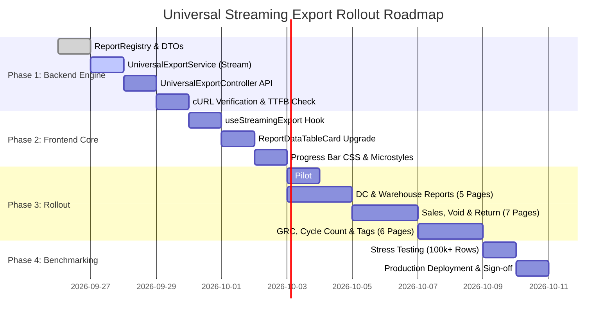

# Universal Streaming Export: Step-by-Step Implementation Roadmap

## Executive Summary
This document outlines the phased, step-by-step engineering roadmap to transition all 23 VMM POS report pages from client-side 10-row exports to a high-scale, server-side streaming engine. 

### Core Architectural Principles
1. **Single Universal API**: Only ONE backend endpoint (`GET /api/reports/export`) handles all 23 report types.
2. **Zero Database Modifications**: Runs 100% on existing production Stored Procedures (`SP_NEW_REPORT` and `SP_NEW_DASHBOARD`) by setting `@PageIndex = 1, @PageSize = 2147483647` or calling native `EXPORT_` blocks.
3. **Flat $O(1)$ Server Memory**: `SqlDataReader` reads rows one-by-one over the database TCP socket and flushes them to the HTTP response stream immediately (~200 bytes RAM per stream).
4. **Zero Browser Tab Freezing**: Browser streams incoming chunks with real-time UI progress updates (`"Exporting 45% (18,000 / 40,000 rows)"`) before generating the final download.

---

## Phase Breakdown

---

## Phase 1: Backend Universal Streaming Engine (.NET 8)

### Step 1: Create `ReportRegistry.cs` (Configuration & Parameter Binder)
- **Path**: `VS_mart_Backend/VS Mart Backend/VS Mart Backend/Features/Dashboard/Export/ReportRegistry.cs`
- **Responsibility**: A static configuration registry mapping each of the 23 `reportName` keys to:
  - Stored Procedure name (`SP_NEW_REPORT` or `SP_NEW_DASHBOARD`).
  - Target `@status` parameter (e.g. `'VIEW_PARK_HU_VENDOR_REPORT'`).
  - Parameter binding logic mapping incoming query parameters to SQL parameters (`@fromdate`, `@todate`, `@Store_code`, `@Vendor_Code`, etc.).
  - Default sort column and direction.

### Step 2: Create `UniversalExportService.cs` (Streaming Execution Engine)
- **Path**: `VS_mart_Backend/VS Mart Backend/VS Mart Backend/Features/Dashboard/Export/UniversalExportService.cs`
- **Responsibility**:
  - Connects to SQL Server via `SqlConnection`.
  - Executes `SqlCommand.ExecuteReaderAsync()`.
  - Dynamically extracts column headers from `reader.GetName(i)` and builds styled Excel `.xlsx` headers (slate-900 bold font, slate-100 fill, bottom borders).
  - Loops `while (await reader.ReadAsync(cancellationToken))` and formats cells with native data types (integers, decimal #,##0.00 currency, timestamps).
  - Auto-fits column widths and freezes header row.
  - Streams OpenXML `.xlsx` package directly into `Response.Body`.
  - Listens to `HttpContext.RequestAborted` to immediately terminate SQL execution if the user cancels or closes their browser.

### Step 3: Create `UniversalExportController.cs`
- **Path**: `VS_mart_Backend/VS Mart Backend/VS Mart Backend/Features/Dashboard/Export/UniversalExportController.cs`
- **Route**: `GET /api/reports/export`
- **Responsibility**:
  - Validates `reportName`.
  - Sets HTTP response headers:
    - `Content-Type: application/vnd.openxmlformats-officedocument.spreadsheetml.sheet`
    - `Content-Disposition: attachment; filename="{reportName}_{yyyyMMdd_HHmmss}.xlsx"`
  - Delegates execution to `UniversalExportService`.

### Step 4: Backend Integration Verification
- Execute a test cURL request against `http://localhost:5050/api/reports/export?reportName=VENDOR_HU_DISCREPANCY_SUMMARY&userId=1&fromDate=2026-09-01&toDate=2026-09-26`.
- Verify:
  - Immediate byte arrival.
  - Complete output of all rows without 10-row cutoff.
  - Generates valid `.xlsx` OpenXML spreadsheet readable by Microsoft Excel.

---

## Phase 2: Frontend Hook & Component Upgrade (React)

### Step 5: Implement `useStreamingExport.js` Hook
- **Path**: `POS_Web_Application React V2/src/hooks/useStreamingExport.js`
- **Responsibility**:
  - Manages `isExporting`, `progressPercent`, `processedRows`, and `exportError`.
  - Calls `fetch(downloadUrl, { signal: abortController.signal })`.
  - Uses `response.body.getReader()` to process streaming binary chunks.
  - Decodes chunks via `TextDecoder('utf-8', { stream: true })` and counts newline occurrences (`\n`) in real time.
  - Updates progress: `percent = Math.min(99, Math.round((receivedRows / totalRecords) * 100))`.
  - Assembles the finished chunks into a `Blob` and triggers automated download via temporary DOM anchor.
  - Provides a `cancelExport()` function that calls `abortController.abort()`.

### Step 6: Upgrade `ReportDataTableCard.jsx`
- **Path**: `POS_Web_Application React V2/src/components/common/ReportDataTableCard.jsx`
- **Responsibility**:
  - Accept optional `reportName` and `exportParams` props.
  - If `reportName` is provided:
    - Wire the **"Export Data To Excel"** button to `useStreamingExport`.
    - When exporting, replace the button with the real-time progress bar:
      `[ ⏳ Exporting: 45% (18,000 / 40,000 rows) ■■■■■□□□□□ [×] ]`
  - *Backward Compatibility Fallback*: If `reportName` is not passed, gracefully fallback to the existing in-memory CSV export so unmigrated pages continue to function without errors.

### Step 7: Progress Bar Styling in `common-reports.css`
- **Path**: `POS_Web_Application React V2/src/pages/Report/common-reports.css`
- **Responsibility**:
  - Neuromorphic container styles for the progress indicator.
  - Smooth width transition for progress track fill (`transition: width 0.15s ease-out`).
  - Animated spinner and hover-styled cancel button.

---

## Phase 3: Rollout Across Report Pages

### Step 8: Pilot Test on `VendorDiscrepancySummaryPage.jsx`
- Pass `reportName="VENDOR_HU_DISCREPANCY_SUMMARY"` and active filter params into `ReportDataTableCard`.
- Test live:
  - Filter by date range `2026-09-01` to `2026-09-26`.
  - Click export. Verify progress bar increments from 0% to 100%.
  - Verify that the downloaded file contains the full dataset (e.g. 40,000 records) and opens natively in Excel.

### Step 9: DC & Warehouse Validation Reports
Migrate the following 5 pages:
1. `HuSummaryReportPage.jsx` $\rightarrow$ `reportName="HU_SUMMARY_VALIDATION"`
2. `HuReportPage.jsx` $\rightarrow$ `reportName="HU_DETAILS"`
3. `DcReportPage.jsx` $\rightarrow$ `reportName="DC_VALIDATION_DETAILS"`
4. `WHEncodingSummaryPage.jsx` $\rightarrow$ `reportName="WAREHOUSE_ENCODING_SUMMARY"`
5. `AllocatedStoreReportPage.jsx` $\rightarrow$ `reportName="ALLOCATED_STORE_ENCODING"`

### Step 10: Sales, Void & Return Reports
Migrate the following 7 pages:
1. `TotalDposSalePage.jsx` $\rightarrow$ `reportName="TOTAL_DPOS_SALE_SUMMARY"`
2. `TotalDposSalePage.jsx` (Grid Breakdown) $\rightarrow$ `reportName="TOTAL_DPOS_SALE_DATA"`
3. `StoreSaleReportPage.jsx` $\rightarrow$ `reportName="STORE_SALE_REPORT"`
4. `VoidDetailsReportPage.jsx` $\rightarrow$ `reportName="VOID_DETAILS"`
5. `VoidReconciliationReportPage.jsx` $\rightarrow$ `reportName="VOID_RECONCILIATION_SUMMARY"`
6. `ReturnDetailsReportPage.jsx` $\rightarrow$ `reportName="RETURN_DETAILS"`
7. `ReturnReconciliationReportPage.jsx` $\rightarrow$ `reportName="RETURN_RECONCILIATION_SUMMARY"`

### Step 11: GRC, Cycle Count & Tag Management Reports
Migrate the following 6 pages:
1. `StoreGrcReportPage.jsx` $\rightarrow$ `reportName="STORE_GRC_SUMMARY"`
2. `GrcReportPage.jsx` $\rightarrow$ `reportName="GRC_DETAILS"`
3. `CycleCountReportPage.jsx` $\rightarrow$ `reportName="CYCLE_COUNT_SUMMARY"`
4. `CycleCountReportPage.jsx` (Audit Ref) $\rightarrow$ `reportName="CYCLE_COUNT_AUDIT_DETAILS"`
5. `TagInventoryDistributionPage.jsx` $\rightarrow$ `reportName="TAG_INVENTORY_DISTRIBUTION"`
6. `LiveStockReportPage.jsx` $\rightarrow$ `reportName="LIVE_STOCK_REPORT"`

---

## Phase 4: Final Validation & Performance Benchmarks

### Step 12: Stress & Resiliency Testing
1. **Throughput Benchmark**: Export a 100,000-row report. Measure time-to-first-byte (< 300ms) and total download completion time.
2. **Server Memory Verification**: Monitor backend RAM during export. Confirm that working set memory remains flat without garbage collection pauses.
3. **Client UI Responsiveness**: Verify that the operator can continue interacting with filters and tabs while a download streams in the background.
4. **Cancellation Test**: Click cancel at 50% download progress. Confirm that the browser connection terminates and SQL Server immediately stops executing the query.
