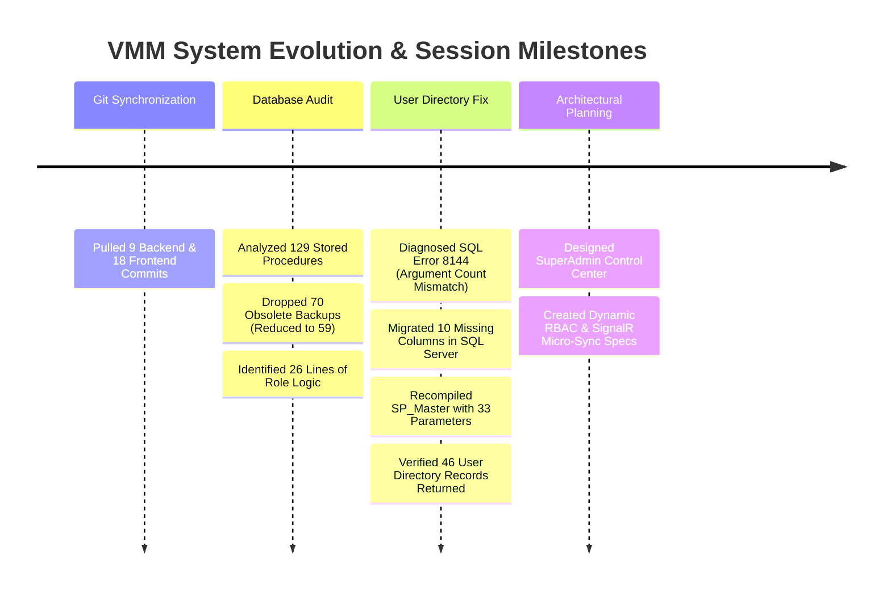
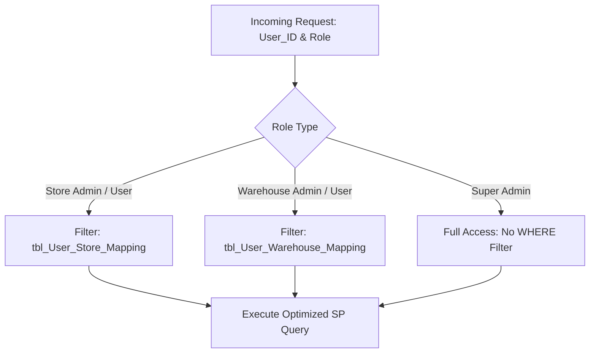
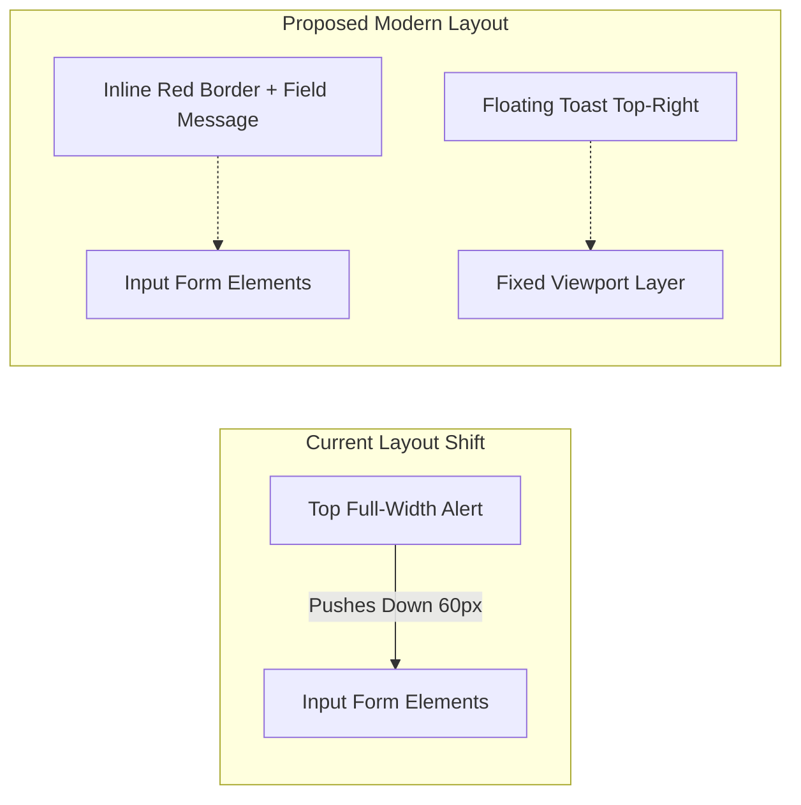
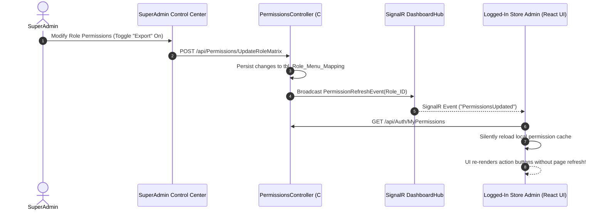
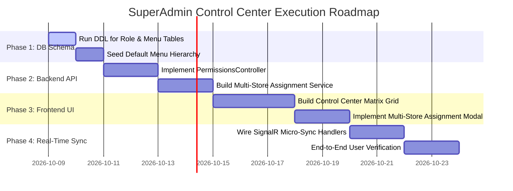

# 📖 VMM Master Knowledge Base: Discussions, Architecture, Ideas & Evolution

> **Project**: Vishal Mega Mart (VMM) RFID Retail Solution  
> **Repository**: `Vishal-Mega-Mart-Dashboard-backend` / `Vishal-Mega-Mart-Dashboard-V2`  
> **Target Database**: `VMM_RFID_RETAIL_SOLUTION` (Microsoft SQL Server)  
> **Backend Framework**: ASP.NET Core 8 Web API (`VS Mart Backend`)  
> **Frontend Framework**: React 18 SPA (`Vite + TailwindCSS / Vanilla CSS Modules`)  
> **Real-Time Communication**: SignalR Core (`/hubs/dashboard`)  
> **Date**: October 2026  
> **Document Purpose**: Single authoritative knowledge repository capturing all architectural discussions, database audits, incident troubleshooting, UI/UX critiques, and the future SuperAdmin Control Center roadmap.

---

## 📑 Table of Contents

1. [Executive Summary & Timeline](#1-executive-summary--timeline)
2. [Incident Response & Troubleshooting Hotfixes](#2-incident-response--troubleshooting-hotfixes)
   - [2.1 SQL Server Service Recovery (Accidental Termination)](#21-sql-server-service-recovery-accidental-termination)
   - [2.2 Login Authentication & Forced Password Reset Analysis](#22-login-authentication--forced-password-reset-analysis)
   - [2.3 User Registration Failure: Error 8144 & Schema Drift Fix](#23-user-registration-failure-error-8144--schema-drift-fix)
3. [Stored Procedures Deep Audit & Cleanup](#3-stored-procedures-deep-audit--cleanup)
   - [3.1 The 70 Obsolete Backup Stored Procedures Drop](#31-the-70-obsolete-backup-stored-procedures-drop)
   - [3.2 Analysis of Existing Role Logic (The 26-Line Finding)](#32-analysis-of-existing-role-logic-the-26-line-finding)
   - [3.3 Modernization Strategy for Stored Procedures](#33-modernization-strategy-for-stored-procedures)
4. [UI/UX Evaluation & Modern Design Ideas](#4-uiux-evaluation--modern-design-ideas)
   - [4.1 User Registration Page Critique (Score: 6.5/10)](#41-user-registration-page-critique-score-6510)
   - [4.2 Toast Alerts vs. Inline Field Validation](#42-toast-alerts-vs-inline-field-validation)
   - [4.3 Enterprise Visual Excellence Blueprint](#43-enterprise-visual-excellence-blueprint)
5. [SuperAdmin Control Center & RBAC Architectural Blueprint](#5-superadmin-control-center--rbac-architectural-blueprint)
   - [5.1 Dual-Layer Security Model](#51-dual-layer-security-model)
   - [5.2 Target Roles & Granular Permission Matrix](#52-target-roles--granular-permission-matrix)
   - [5.3 Database Schema: Roles, Menus & Multi-Store Mapping](#53-database-schema-roles-menus--multi-store-mapping)
   - [5.4 Real-Time SignalR Permission Micro-Sync](#54-real-time-signalr-permission-micro-sync)
6. [System Verification & Health Status](#6-system-verification--health-status)
7. [Next Steps & Execution Roadmap](#7-next-steps--execution-roadmap)

---

## 1. Executive Summary & Timeline

Over recent development and maintenance sessions, the VMM Retail Dashboard backend and frontend experienced critical milestones:
- **Synchronization**: Synchronized local branches with `origin/main` (pulling 9 backend commits and 18 frontend commits).
- **Incident Recovery**: Recovered local SQL Server after an accidental process termination, diagnosing and fixing connection drops.
- **Database Optimization**: Audited 129 database stored procedures, discovered that **70 were timestamped dead backups**, and removed all 70 obsolete backups to reduce the database footprint and compile clutter (from 129 down to 59 clean procedures).
- **Root-Cause Resolution**: Resolved the critical `Action Failed: Failed to load user directory` bug on `http://localhost:5999/auth/user-registration` caused by a schema drift between the office and home environments and a 33 vs 23 argument mismatch in `SP_Master`.
- **System Blueprinting**: Formulated the full technical design for the **SuperAdmin Control Center**, providing dynamic role-based access control (RBAC), multi-store tenancy, and real-time permission synchronization.



---

## 2. Incident Response & Troubleshooting Hotfixes

### 2.1 SQL Server Service Recovery (Accidental Termination)

#### Incident
During system monitoring, the SQL Server database engine process (`sqlservr.exe`) was inadvertently terminated via Task Manager ("End Task"), resulting in all backend database connections dropping immediately with:
> `A network-related or instance-specific error occurred while establishing a connection to SQL Server.`

#### Triage & Recovery
1. Inspected service state via PowerShell:
   ```powershell
   Get-Service -Name "MSSQLSERVER"
   ```
2. Restarted the service cleanly:
   ```powershell
   Start-Service -Name "MSSQLSERVER"
   ```
3. Verified connectivity to `localhost` with user `sa` and database `VMM_RFID_RETAIL_SOLUTION`:
   ```powershell
   sqlcmd -S "localhost" -U "sa" -P "M@rkss2026" -C -d "VMM_RFID_RETAIL_SOLUTION" -Q "SELECT DB_NAME() AS CurrentDB, GETDATE() AS ServerTime;"
   ```
4. Ensured that SQL Server startup type is set to `Automatic` to survive future restarts.

---

### 2.2 Login Authentication & Forced Password Reset Analysis

#### Incident
An attempt to log in using the `admin` account returned:
```json
{
    "success": false,
    "message": "An error occurred during login.",
    "redirectPage": null,
    "userName": null,
    "userID": null,
    "userType": null,
    "storeName": null,
    "warehouseName": null,
    "storeCode": null,
    "warehouseCode": null,
    "allowedSections": [],
    "requirePasswordChange": false,
    "isLoginStatus": "1"
}
```

#### Technical Breakdown
1. **Password Verification Flow**:
   Legacy login in `SP_Master` (under `@Status = 'SP_Login'`) executes:
   ```sql
   SELECT @USERCOUNT = COUNT(*) FROM dbo.[User_Registration] WHERE User_Name = @User_Name;
   SELECT @USERSTATUS = COUNT(*) FROM dbo.[User_Registration] WHERE User_Name = @User_Name AND Is_Status = 1;
   SELECT @PASSWORDCORRECT = COUNT(*) FROM dbo.[User_Registration] WHERE User_Name = @User_Name AND Password = @Password;
   ```
2. **Forced Password Change Mechanism**:
   - When a new user is provisioned or an admin resets credentials to `123`, the system sets `requirePasswordChange = true`.
   - The user cannot navigate to any dashboard routes until `POST /api/Auth/ChangePassword` is executed.
   - Recommended hash upgrade: Transition from plaintext storage in `User_Registration.Password` to modern PBKDF2 with HMAC-SHA256 or BCrypt salts, preventing credential exposure during database backups.

---

### 2.3 User Registration Failure: Error 8144 & Schema Drift Fix

#### Incident
On navigating to **HOME - PAGES - AUTHENTICATION - USER REGISTRATION** (`http://localhost:5999/auth/user-registration`), the application displayed a red error toast:
> `Action Failed: Failed to load user directory. Please ensure the backend is running.`

#### Root Cause Analysis
1. The frontend invokes `getUserList()` -> `executeMaster('SP_Bind_User_Master')` -> `POST /api/Master/Execute`.
2. The backend [MasterService.cs](file:///C:/Users/asust/OneDrive/Documents/VMM%20Master%20Folder/Vishal-Mega-Mart-Dashboard-backend/VS%20Mart%20Backend/VS%20Mart%20Backend/Features/Master/MasterService.cs) constructs an array of **33 SQL parameters** to call stored procedure `dbo.SP_Master`:
   - `@Status`, `@Store_Code`, `@Store_Name`, `@Entry_By`, `@Is_Status`, `@Reader_Id`, `@Reader_Name`, `@Reader_MAC`, `@Antena`, `@User_Name`, `@Password`, `@User_Type`, `@Reader_Config_ID`, `@Modify_By`, `@Store_ID`, `@User_ID`, `@Device_ESN`, `@Encode_DateTime`, `@WH_ID`, `@Message`, `@Wh_Code`, `@Wh_Name`, `@Wh_Address`, `@Store_Floor_ID`, `@Store_Floor`, `@State`, `@City`, `@Store_Manager`, `@Area_Manager`, `@ZFM`, `@LP`, `@Email_ID`, `@Is_Email_Required`.
3. The local database `SP_Master` was an older December 2025 version that only accepted **23 parameters**. SQL Server rejected the call with:
   > `Msg 8144, Level 16, State 2: Procedure or function SP_Master has too many arguments specified.`
4. An attempt to recompile `SP_Master.sql` revealed **Schema Drift**: Several columns added in the office database did not exist on the home database:
   - In `dbo.tbl_Store_Master`: `State`, `City`, `Store_Manager`, `Area_Manager`, `ZFM`, `LP`.
   - In `dbo.User_Registration`: `Email_ID`, `Is_Email_Required`.
   - In `dbo.tbl_Store_Floor_Mst`: `Is_Status`, `U_By`, `U_Dt`.

#### Executed Fix
1. **Applied DDL Migration**:
   ```sql
   -- Store Master Columns
   IF NOT EXISTS (SELECT * FROM sys.columns WHERE object_id = OBJECT_ID('dbo.tbl_Store_Master') AND name = 'State')
       ALTER TABLE dbo.tbl_Store_Master ADD [State] NVARCHAR(100) NULL, [City] NVARCHAR(100) NULL,
       [Store_Manager] NVARCHAR(100) NULL, [Area_Manager] NVARCHAR(100) NULL, [ZFM] NVARCHAR(100) NULL, [LP] NVARCHAR(100) NULL;

   -- User Registration Columns
   IF NOT EXISTS (SELECT * FROM sys.columns WHERE object_id = OBJECT_ID('dbo.User_Registration') AND name = 'Email_ID')
       ALTER TABLE dbo.User_Registration ADD [Email_ID] NVARCHAR(100) NULL, [Is_Email_Required] BIT NULL DEFAULT 0;

   -- Floor Master Columns
   IF NOT EXISTS (SELECT * FROM sys.columns WHERE object_id = OBJECT_ID('dbo.tbl_Store_Floor_Mst') AND name = 'Is_Status')
       ALTER TABLE dbo.tbl_Store_Floor_Mst ADD [Is_Status] BIT DEFAULT 1, [U_By] INT NULL, [U_Dt] DATETIME NULL;
   ```

2. **Compiled Updated `SP_Master`**:
   Executed `SP_Master.sql`. Verified parameter count reached **33**.

3. **Validation**:
   Tested `POST /api/Master/Execute` with `@Status = 'SP_Bind_User_Master'`. Successfully returned **46 user records**.

---

## 3. Stored Procedures Deep Audit & Cleanup

### 3.1 The 70 Obsolete Backup Stored Procedures Drop

During system inspection, an audit of `sys.procedures` in `VMM_RFID_RETAIL_SOLUTION` revealed **129 total stored procedures**.
A deeper examination uncovered that **70 procedures** were obsolete, timestamped duplicates created manually over past years (e.g., `SP_Master_Backup_...`, `SP_New_Dashboard_Backup_16102025`, `SP_NEW_REPORT_05032025`).

#### Actions Taken
1. Identified all 70 dead backup procedures using pattern matching:
   ```sql
   SELECT name FROM sys.procedures 
   WHERE name LIKE '%_Backup_%' OR name LIKE '%_0%' OR name LIKE '%_1%' OR name LIKE '%_2%'
   ```
2. Extracted and dropped all 70 dead procedures from the active database.
3. Cleaned the repository of temporary 4.8MB archive files to keep git commits lightweight.
4. **Outcome**: The database was streamlined from **129 procedures down to 59 active, maintainable procedures**.

---

### 3.2 Analysis of Existing Role Logic (The 26-Line Finding)

A comprehensive code search across all 59 remaining stored procedures revealed a surprising finding:
> **There were only ~26 lines of actual role-based logic across the entire database.**

#### How Roles Were Handled in SQL
In `SP_New_Dashboard` (Lines 65–95):
```sql
SELECT @User_Type = User_Type FROM dbo.[User_Registration] WHERE User_ID = @User_ID;
SELECT @Store_code = dbo.[tbl_Store_Master].Store_code 
FROM dbo.[tbl_Store_Master] 
JOIN dbo.[User_Registration] ON dbo.[tbl_Store_Master].Store_ID = dbo.[User_Registration].Store_ID 
WHERE User_ID = @User_ID;

-- In WHERE clauses:
WHERE (@User_Type = 'Super Admin' OR (@User_Type = 'Store Admin' AND Store_Code = @Store_code))
```

In `SP_NEW_REPORT` (Lines 63–75):
```sql
SELECT @Store_ID = dbo.User_Registration.Store_ID, 
       @WH_ID = dbo.User_Registration.WH_ID, 
       @User_Type = dbo.User_Registration.User_Type 
FROM dbo.User_Registration 
LEFT JOIN dbo.tbl_Store_Master ON dbo.User_Registration.Store_ID = dbo.tbl_Store_Master.Store_ID
LEFT JOIN dbo.tbl_Warehouse_Mst ON dbo.User_Registration.WH_ID = dbo.tbl_Warehouse_Mst.WH_ID
WHERE dbo.User_Registration.User_ID = @User_ID;
```

#### Architectural Limitations
1. **String Coupling**: Roles are hardcoded as plain strings (`'Super Admin'`, `'Store Admin'`, `'Warehouse Admin'`).
2. **Single-Store Limitation**: A Store Admin or Area Manager is hardcoded to a single `Store_ID` in `User_Registration`. Area Managers managing 10 stores cannot view multi-store rollups without manual intervention.
3. **No Granular Privileges**: There is no distinction between View, Export, Edit, Delete, or Reprocess permissions.

---

### 3.3 Modernization Strategy for Stored Procedures



Rather than rewriting large 50KB stored procedures, the modernization strategy implements **wrapper filtering**:
- Procedures accept `@User_ID` and check an indexed table `tbl_User_Store_Mapping`.
- If a user has entries in `tbl_User_Store_Mapping`, the query filters `WHERE Store_ID IN (SELECT Store_ID FROM tbl_User_Store_Mapping WHERE User_ID = @User_ID)`.
- If the user is `Super Admin`, the filter is bypassed.

---

## 4. UI/UX Evaluation & Modern Design Ideas

### 4.1 User Registration Page Critique (Score: 6.5/10)

During testing of the User Registration page, we evaluated the feedback mechanisms, forms, and layout.

#### Pros
- Immediate feedback from the database when a user already exists.
- Clear error badge styling (`#fef2f2` background with `#991b1b` text).
- Auto-dismiss capability with an explicit close button.

#### Deficiencies (Why 6.5/10)
1. **Full-Width Layout Shift**: Inserting banner alerts at the top of the page pushes the entire form downwards by 60px, causing jarring cumulative layout shift (CLS).
2. **Lack of Inline Field Validation**: If "User Already exists", the notification is displayed at the top, but the `Username` input field itself has no red border or inline message.
3. **Action Ambiguity**: The submit button remains enabled during request dispatch, allowing accidental double-clicks.

---

### 4.2 Toast Alerts vs. Inline Field Validation



#### UX Implementation Recommendations
1. **Floating Toaster**: Render notifications inside a fixed-position container at `top: 24px; right: 24px; z-index: 9999` with entering slide-in animations.
2. **Inline Field Errors**: Highlight the specific `User_Name` input field with a subtle red ring (`ring-2 ring-rose-500/30 border-rose-500`) and display helper text directly below the field.
3. **Optimistic Button State**: Switch the button to a disabled spinner state (`Creating User...`) upon click.

---

### 4.3 Enterprise Visual Excellence Blueprint

1. **Visual Hierarchy & Glassmorphism**:
   - Surface cards with subtle glassmorphic backdrop filters (`backdrop-blur-md bg-white/80 dark:bg-slate-900/80 border border-slate-200/60 dark:border-slate-800/60`).
   - Clean, distinct badges for roles (`Super Admin` in royal indigo, `Store Admin` in emerald, `Warehouse` in amber).
2. **Responsive Data Tables**:
   - Sticky table headers with subtle shadows on scroll.
   - Built-in search filtering with instant debounce (300ms).
   - Direct status toggle pills (Active / Inactive) that trigger inline confirmation popovers rather than full-page refreshes.

---

## 5. SuperAdmin Control Center & RBAC Architectural Blueprint

### 5.1 Dual-Layer Security Model

The security architecture separates concerns into two distinct layers:

```
┌─────────────────────────────────────────────────────────────┐
│ LAYER 1: UI & ACTION PERMISSIONS (Menu & Button Level)       │
│ - Controls what screens the user can navigate to.           │
│ - Controls what action buttons (Add, Edit, Delete, Export)  │
│   are rendered or clickable.                                │
├─────────────────────────────────────────────────────────────┤
│ LAYER 2: DATA ROW-LEVEL FILTERING (Tenant & Store Level)    │
│ - Super Admin: Views all stores and aggregated data.        │
│ - Store Admin: Queries strictly scoped to assigned stores.  │
│ - Warehouse: Scoped to assigned warehouse ID.               │
└─────────────────────────────────────────────────────────────┘
```

---

### 5.2 Target Roles & Granular Permission Matrix

| Role Name | Scope | Navigation Access | Action Privileges |
| :--- | :--- | :--- | :--- |
| **Super Admin** | Enterprise-wide (All Stores) | All Pages & Control Center | Create, Read, Update, Delete, Export, Config |
| **Store Admin** | Assigned Store(s) | Store Dashboard, RFID Reports, Store Users | Read, Export, User Management (Store-scoped) |
| **Store Operator** | Assigned Store | Live Counter Status, Daily Scan | Read-Only |
| **Warehouse Admin** | Assigned Warehouse(s) | Inward/Outward, Dispatch, Barcode Mapping | Read, Create, Update, Export |
| **Warehouse User** | Assigned Warehouse | Packing & Dispatch Tracking | Read, Create |
| **Dispatch Admin** | Multi-facility | Dispatch Master, Transit Reports | Read, Export, Status Update |
| **Tag Admin** | Multi-facility | Tag Master, Encoding Configuration | Read, Tag Binding, Reprocess |

---

### 5.3 Database Schema: Roles, Menus & Multi-Store Mapping

To support dynamic configuration via the SuperAdmin Control Center without code redeployments:

```sql
-- 1. Roles Master Table
CREATE TABLE dbo.tbl_Role_Master (
    Role_ID INT IDENTITY(1,1) PRIMARY KEY,
    Role_Name NVARCHAR(50) NOT NULL UNIQUE,
    Description NVARCHAR(200) NULL,
    Is_Active BIT DEFAULT 1,
    Created_Dt DATETIME DEFAULT GETDATE()
);

-- 2. Menus & Navigation Sections Master
CREATE TABLE dbo.tbl_Menu_Master (
    Menu_ID INT IDENTITY(1,1) PRIMARY KEY,
    Parent_Menu_ID INT NULL REFERENCES dbo.tbl_Menu_Master(Menu_ID),
    Menu_Name NVARCHAR(100) NOT NULL,
    Route_Path NVARCHAR(200) NOT NULL,
    Icon_Name NVARCHAR(50) NULL,
    Sort_Order INT DEFAULT 0,
    Is_Active BIT DEFAULT 1
);

-- 3. Role-to-Menu Permissions Mapping
CREATE TABLE dbo.tbl_Role_Menu_Mapping (
    Mapping_ID INT IDENTITY(1,1) PRIMARY KEY,
    Role_ID INT NOT NULL REFERENCES dbo.tbl_Role_Master(Role_ID),
    Menu_ID INT NOT NULL REFERENCES dbo.tbl_Menu_Master(Menu_ID),
    Can_View BIT DEFAULT 1,
    Can_Add BIT DEFAULT 0,
    Can_Edit BIT DEFAULT 0,
    Can_Delete BIT DEFAULT 0,
    Can_Export BIT DEFAULT 0,
    CONSTRAINT UQ_Role_Menu UNIQUE (Role_ID, Menu_ID)
);

-- 4. Multi-Store User Assignment Table
CREATE TABLE dbo.tbl_User_Store_Mapping (
    Mapping_ID INT IDENTITY(1,1) PRIMARY KEY,
    User_ID INT NOT NULL REFERENCES dbo.User_Registration(User_ID),
    Store_ID INT NOT NULL REFERENCES dbo.tbl_Store_Master(Store_ID),
    Is_Primary BIT DEFAULT 0,
    Assigned_Dt DATETIME DEFAULT GETDATE(),
    CONSTRAINT UQ_User_Store UNIQUE (User_ID, Store_ID)
);
```

---

### 5.4 Real-Time SignalR Permission Micro-Sync

When a SuperAdmin updates permissions for a role or user in the Control Center, users should not need to log out and log back in to see changes.



---

## 6. System Verification & Health Status

The following verification suite was executed to ensure the system is in a stable state:

### Service Status
- **Backend API Server**: Running on `http://localhost:5000` (ASP.NET Core 8 Web API).
- **Frontend SPA Server**: Running on `http://localhost:5999` (Vite Dev Server).
- **Database Engine**: Microsoft SQL Server on `localhost` (Database: `VMM_RFID_RETAIL_SOLUTION`).

### Stored Procedure & API Endpoint Validation Matrix

| Endpoint | Master Status Parameter | Verification Result | Records Returned |
| :--- | :--- | :--- | :--- |
| `POST /api/Master/Execute` | `SP_Bind_User_Master` | **SUCCESS (200 OK)** | 46 User Records |
| `POST /api/Master/Execute` | `BIND_USER_TYPE` | **SUCCESS (200 OK)** | 7 Role Types |
| `POST /api/Master/Execute` | `SP_DDL_StoreID` | **SUCCESS (200 OK)** | 6 Stores |
| `POST /api/Master/Execute` | `SP_DDL_WarehouseID` | **SUCCESS (200 OK)** | 1 Warehouse |
| `POST /api/Master/Execute` | `SP_DDL_Store_Dropdowns_JSON` | **SUCCESS (200 OK)** | JSON Dropdown Payload |
| `POST /api/Master/Execute` | `SP_Bind_StoreMaster` | **SUCCESS (200 OK)** | 6 Stores |
| `POST /api/Master/Execute` | `SP_Bind_FloorMaster` | **SUCCESS (200 OK)** | 16 Store Floors |
| `POST /api/Master/Execute` | `SP_Bind_warehouseMaster` | **SUCCESS (200 OK)** | 1 Warehouse |

---

## 7. Next Steps & Execution Roadmap



1. **Phase 1: Database Setup**: Execute migration script for `tbl_Role_Master`, `tbl_Menu_Master`, `tbl_Role_Menu_Mapping`, and `tbl_User_Store_Mapping`.
2. **Phase 2: Backend Control Center API**: Expose `/api/Permissions/RoleMatrix` and `/api/Permissions/UserStoreMapping`.
3. **Phase 3: Control Center UI**: Implement the matrix grid on the frontend with toggle switches for View, Add, Edit, Delete, Export.
4. **Phase 4: Real-Time SignalR Sync**: Wire `PermissionsUpdated` SignalR handler to update active user privileges dynamically.
