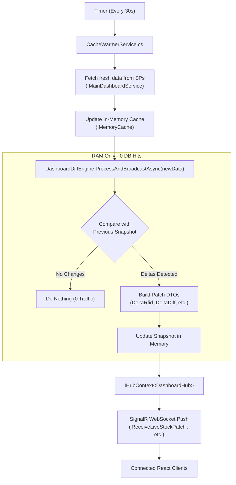

# Architectural Plan: Cache-Warmer Diff Engine & WebSocket Push

## 1. Executive Summary & Objective

### The Problem
The previous real-time update design relied on active background polling workers (`LiveStockPollerService`, `DashboardSectionsPollerService`) running heavy Stored Procedures (`SP_New_Dashboard`, `SP_NEW_REPORT`) every 1–2 seconds. This caused severe SQL Server thread exhaustion, lock contention, and high CPU usage, degrading overall POS responsiveness.

### The Proposed Solution: "Piggybacked Cache-Warmer Diffing"
Instead of separate background polling services constantly querying the database:
1. `CacheWarmerService` is **already running** periodically (e.g. every 30 seconds) to keep the Universal Master Cache hot for users.
2. We **reuse those exact warmed results** in RAM.
3. A lightweight in-memory **Diff Engine** compares the freshly warmed dataset against the previous in-memory snapshot.
4. If deltas are detected, the diff engine constructs the exact patch payloads (`ReceiveLiveStockPatch`, `ReceiveCycleCountPatch`, etc.) and broadcasts them via SignalR (`DashboardHub`).
5. **Zero additional database queries** are made for real-time updates. The database load from polling drops to **0%**.

---

## 2. Deep Analysis of Current Implementation

### 2.1 Existing Diff Logic in Codebase
We examined the existing polling implementations and located their diff engines:

1. **LiveStock Diff Engine** (found in `LiveStockPollerService.cs` lines 262–324):
   - Maintains `ConcurrentDictionary<string, StoreSnapshot> _snapshot` in memory.
   - Compares current row values (`RFID_STOCK`, `DIFFERENCE`) against `_snapshot[storeCode]`.
   - Computes deltas:
     - `deltaRfid = newRfid - oldSnapshot.RfidStock;`
     - `deltaDiff = newDiff - oldSnapshot.Difference;`
     - Summary deltas: `TotalRfidDelta`, `TotalDiffDelta`.
   - Constructs `LiveStockDeltaPatch`.
   - Broadcasts to SignalR clients via `await _hubContext.Clients.All.SendAsync("ReceiveLiveStockPatch", patch)`.

2. **Dashboard Sections Diff Engine** (found in `DashboardSectionsPollerService.cs` lines 282–897):
   - **Cycle Count**: Checks `oldSnap.ScannedQty != scannedQty || oldSnap.NetDiff != netDiff` → broadcasts `"ReceiveCycleCountPatch"`.
   - **Store Validation**: Checks `oldSnap.ScannedQty != scanned || oldSnap.TotalHU != hu` → broadcasts `"ReceiveStoreValidationPatch"`.
   - **DC Encoding**: Checks daily encoded totals → broadcasts `"ReceiveDcEncodingPatch"`.
   - **Tag Management**: Checks available tags → broadcasts `"ReceiveTagManagementPatch"`.
   - **Vendor Discrepancy**: Checks `oldSnap.DiffQty != diff` → broadcasts `"ReceiveVendorDiscrepancyPatch"`.
   - **DC Validation**: Checks DC validation totals → broadcasts `"ReceiveDcValidationPatch"`.

3. **Existing Frontend Handlers**:
   - In `POS_Web_Application React V2/src/services/liveStockSocket.js`:
     ```javascript
     this.connection.on('ReceiveLiveStockPatch', (patch) => {
       // Processes delta update in state
     });
     ```
   - Retaining the exact same event names and DTO properties ensures **100% frontend compatibility with zero client-side breakage**.

---

## 3. Files to Delete / Clean Up

| File / Component | Action | Reason |
|---|---|---|
| `Services/LiveStockPollerService.cs` | **DELETE** | Deprecated aggressive 1-second poller. |
| `Services/DashboardSectionsPollerService.cs` | **DELETE** | Deprecated aggressive 2-second poller. |
| `Services/SqlNotificationService.cs` | **DELETE** | Commented out, unused legacy notification worker. |
| `Program.cs` (lines 43–45) | **MODIFY** | Remove commented-out hosted service registrations. |
| Poller Telemetry Endpoints in `Program.cs` | **MODIFY** | Clean up endpoints referencing deleted poller classes. |

> [!NOTE]
> Before deleting the poller files, all DTO models (`LiveStockDeltaPatch`, `CycleCountDeltaPatch`, etc.) will be extracted and moved to a clean, permanent home (`Features/Dashboard/Hubs/Models/`).

---

## 4. Proposed Architecture: `IDashboardDiffEngine`

### Architecture Flow Diagram



### Components to Create:

1. **`IDashboardDiffEngine` & `DashboardDiffEngine`**:
   - Injected into `CacheWarmerService`.
   - Holds the in-memory snapshots (`ConcurrentDictionary`).
   - Contains clean diff methods:
     - `ProcessLiveStockDiff(IEnumerable<LiveStockItem> freshItems, LiveStockSummary summary)`
     - `ProcessCycleCountDiff(...)`
     - `ProcessVendorDiscrepancyDiff(...)`
     - (and other active sections as needed).
   - Resolves `IHubContext<DashboardHub>` and broadcasts when differences are found.

2. **Patch DTO Models**:
   - Location: `Features/Dashboard/Hubs/Models/DashboardPatchModels.cs`
   - Preserves all fields expected by frontend (`Type`, `Timestamp`, `StoreCode`, `DeltaRfid`, `SummaryDelta`, etc.).

3. **Update `CacheWarmerService.cs`**:
   - Update loop delay: Change default loop delay to 30 seconds (configurable via `appsettings.json`).
   - After each section is fetched and cached, invoke `_diffEngine.ProcessLiveStockDiff(...)`.

---

## 5. Architectural Comparison: Before vs. Proposed

| Metric / Aspect | Previous Poller Architecture | Proposed Cache-Warmer Diff |
|---|---|---|
| **Database Queries / Min** | ~60 – 120 heavy SP queries/min | **~2 queries/min** (98% reduction) |
| **Database Locking** | High lock contention on main tables | **None** from real-time features |
| **Diff Location** | Scattered in polling background loops | Clean, centralized `DashboardDiffEngine` |
| **Real-time Latency** | ~1–2 seconds | **~30 seconds** (matches warm cycle) |
| **System Stability** | Prone to connection pooling exhaustion | Extremely stable; predictable batching |
| **Frontend Breaking Changes** | None | **Zero** (identical SignalR patch payloads) |

---

## 6. Open Design Questions for Review

1. **Warming Interval**: Should the cache warmer run strictly every **30 seconds**, or should it be configurable in `appsettings.json` (e.g. `CacheWarmer:IntervalSeconds = 30`)?
2. **Sections Included in WebSocket Broadcast**:
   - LiveStock Report (Essential)
   - Cycle Count (Recommended)
   - Vendor HU Discrepancy (Recommended)
   - Store Dashboard / GRC (Optional)
   Do you want all of them, or only LiveStock for the first release?
3. **Approval to Proceed**: Do you approve deleting `LiveStockPollerService.cs`, `DashboardSectionsPollerService.cs`, and `SqlNotificationService.cs` once DTOs are relocated?
