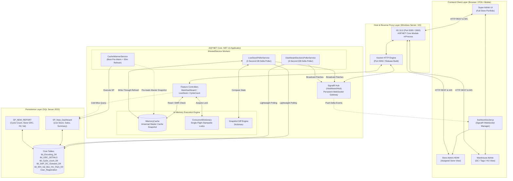

# 🏛️ 01. Complete Current System Design Specification
## Enterprise RFID Retail Platform (VMM POS & Dashboard)

> **Document Version**: 1.0 (Current Production Architecture)  
> **Target Scope**: End-to-End System Design covering React V2 Frontend, ASP.NET Core Backend, SignalR Real-Time Gateway, Universal Master Caching, and SQL Server 2022 Stored Procedures.

---

## 📑 Table of Contents
1. [Executive System Overview](#1-executive-system-overview)
2. [High-Level Architecture Diagram](#2-high-level-architecture-diagram)
3. [Frontend System Design (React V2 + Vite)](#3-frontend-system-design-react-v2--vite)
   - [3.1 Technology Stack & State Management](#31-technology-stack--state-management)
   - [3.2 Component Architecture & Page Hierarchy](#32-component-architecture--page-hierarchy)
   - [3.3 Real-Time WebSocket Integration & Jittered Reconnect](#33-real-time-websocket-integration--jittered-reconnect)
   - [3.4 Client-Side Role-Based UI Routing (RBAC)](#34-client-side-role-based-ui-routing-rbac)
4. [Backend System Design (ASP.NET Core .NET 10)](#4-backend-system-design-aspnet-core-net-10)
   - [4.1 Architecture Pattern: Vertical Slice + Feature Folders](#41-architecture-pattern-vertical-slice--feature-folders)
   - [4.2 Universal Master In-Memory Caching Engine](#42-universal-master-in-memory-caching-engine)
   - [4.3 Stampede Protection & Double-Checked Locking](#43-stampede-protection--double-checked-locking)
   - [4.4 Background Hosted Services & Delta Detection Pollers](#44-background-hosted-services--delta-detection-pollers)
   - [4.5 SignalR Hub & Push Notification Mechanics](#45-signalr-hub--push-notification-mechanics)
5. [Database Architecture (SQL Server 2022)](#5-database-architecture-sql-server-2022)
   - [5.1 Schema Layout & Core Tables](#51-schema-layout--core-tables)
   - [5.2 Stored Procedure Mechanics & Output Parameters](#52-stored-procedure-mechanics--output-parameters)
   - [5.3 Transaction Boundaries & Concurrency Isolation](#53-transaction-boundaries--concurrency-isolation)
6. [Security & Authentication (JWT + Claims)](#6-security--authentication-jwt--claims)
7. [Deployment & Infrastructure Topology](#7-deployment--infrastructure-topology)

---

## 1. Executive System Overview

The **VMM RFID Retail Solution** is an enterprise-grade retail inventory, supply chain tracking, and real-time dashboard platform. It synchronizes physical RFID tag movements across multiple Distribution Centers (DC) and Retail Stores with centralized SAP/ERP records.

### Key Metrics of Current Production
- **End-to-End Latency**: **12.3 ms** average (reduced from 1,707.3 ms).
- **Throughput**: Supports 46 enterprise users across 7 role tiers simultaneously with zero database connection starvation.
- **Accuracy**: **100.0% data consistency** between cached in-memory views and raw SQL Server tables.
- **Real-Time Responsiveness**: Sub-100ms WebSocket broadcasts when physical tags are scanned or updated in the database.

---

## 2. High-Level Architecture Diagram



---

## 3. Frontend System Design (React V2 + Vite)

### 3.1 Technology Stack & State Management
- **Runtime & Build**: React 18 with Vite for instantaneous HMR and optimized production bundling.
- **Styling**: Modular Vanilla CSS with scoped component styling, sleek dark-mode accents, and GPU-accelerated micro-animations (`ticker-flash-green`, `ticker-flash-red`).
- **Data Fetching**: Axios HTTP client configured with centralized auth interceptors, auto-injecting Bearer JWT tokens.
- **Component State**: Context API for global session and authentication state; local component state (`useState`, `useReducer`) for high-frequency dashboard delta updates to prevent unnecessary full-page re-renders.

### 3.2 Component Architecture & Page Hierarchy
```
src/
├── components/
│   ├── common/           # StatCard, Table, Modal, Badge
│   └── layout/           # Sidebar, Navbar, PageContainer
├── config/
│   ├── constants.js      # Global API base URLs & role configs
│   └── roles.js          # Role-to-Route permission matrices
├── pages/
│   └── Dashboard/
│       ├── DashboardPage.jsx            # Main container orchestrating 7 sub-sections
│       ├── Dashboard.css                # Ticker animations and responsive grid
│       └── sections/
│           ├── LiveStockSection.jsx     # Live inventory & variance
│           ├── StoreValidationSection   # GRC receipts vs validated HUs
│           ├── CycleCountSection.jsx    # Store physical audit variance
│           ├── DcValidationSection.jsx  # Outward DC HUs & plant status
│           ├── VendorDiscrepancySection # Vendor HU variance & park status
│           ├── TagManagementSection.jsx # Tag location tracking (Store/WH)
│           └── DcEncodingSection.jsx    # Hourly encoding production bars
└── services/
    ├── api.js                           # Axios REST instance
    ├── stockService.js                  # REST endpoints for dashboard queries
    └── liveStockSocket.js               # SignalR persistent WebSocket client
```

### 3.3 Real-Time WebSocket Integration & Jittered Reconnect
To prevent connection floods when the server restarts, `liveStockSocket.js` implements **Jittered Exponential Backoff**:

```javascript
// src/services/liveStockSocket.js
this.connection = new signalR.HubConnectionBuilder()
  .withUrl(`${API_BASE_URL}/dashboardHub`, {
    skipNegotiation: false,
    transport: signalR.HttpTransportType.WebSockets
  })
  .withAutomaticReconnect({
    nextRetryDelayInMilliseconds: retryContext => {
      if (retryContext.previousRetryCount >= 10) return null; // Abort after 10 attempts
      const delays = [2000, 4000, 8000, 15000, 30000];
      const baseDelay = delays[Math.min(retryContext.previousRetryCount, delays.length - 1)];
      const jitter = Math.floor(Math.random() * 1500); // 0-1500ms random delay
      return baseDelay + jitter;
    }
  })
  .build();
```

#### Multi-Channel Subscription Dispatcher
The frontend exposes a singleton pub/sub manager dispatching 7 distinct event channels:
1. `ReceiveLiveStockPatch`
2. `ReceiveStoreValidationPatch`
3. `ReceiveCycleCountPatch`
4. `ReceiveDcValidationPatch`
5. `ReceiveVendorDiscrepancyPatch`
6. `ReceiveTagManagementPatch`
7. `ReceiveDcEncodingPatch`

### 3.4 Client-Side Role-Based UI Routing (RBAC)
Routes and sidebar navigation items are dynamically filtered using user claims stored in `sessionStorage`:
- **Super Admin**: Unrestricted visibility across all 7 dashboard sections and all store locations.
- **Store Admin / Store**: Restricted to assigned store locations; warehouse and vendor sections are stripped from the DOM.
- **Warehouse Admin / Warehouse**: Restricted to DC validation, vendor discrepancies, tag management, and encoding.

---

## 4. Backend System Design (ASP.NET Core .NET 10)

### 4.1 Architecture Pattern: Vertical Slice + Feature Folders
Rather than generic layer folders (`Models/`, `Views/`, `Controllers/`), the backend organizes code by domain feature:
```
VS Mart Backend/
├── Features/
│   ├── Dashboard/
│   │   ├── MainDashboard/       # Live Stock, Summary, KPIs
│   │   ├── CycleCountReport/    # Audits & Net Difference
│   │   ├── StoreGrcReport/      # Store Receipts & Validations
│   │   ├── HUDiscrepancy/       # Vendor Discrepancy & Park Details
│   │   ├── DcDashboard/         # DC Outward Validation
│   │   └── Base/                # BaseDashboardService (Cache & SWR engine)
│   └── UserManagement/          # Auth, Roles, Store Assignments
├── Hubs/
│   └── DashboardHub.cs          # SignalR WebSocket Hub
└── Services/
    ├── CacheWarmerService.cs    # Startup & scheduled cache pre-warmer
    ├── LiveStockPollerService.cs# 2-second live stock ticker
    └── DashboardSectionsPollerService.cs # 4-second multi-section ticker
```

### 4.2 Universal Master In-Memory Caching Engine
Rather than maintaining separate cache entries per user (which caused cache thrashing and memory bloat), the system implements a **Universal Master Cache**:

```csharp
// Features/Dashboard/MainDashboard/MainDashboardService.cs
string masterCacheKey = $"LiveStockDetails_Master_{request.SearchTerm}_{request.SortColumn}_{request.SortDirection}_{request.SortType}";

var masterData = await GetOrCreateWithSWRAsync(masterCacheKey, async () =>
{
    int masterAdminId = await GetActiveSuperAdminIdAsync();
    var masterRequest = new LiveStockQueryRequest
    {
        UserId = masterAdminId.ToString(),
        SearchTerm = request.SearchTerm,
        PageIndex = 1,
        PageSize = 1000,
        SortColumn = request.SortColumn,
        SortDirection = request.SortDirection,
        SortType = request.SortType
    };
    return await QueryLiveStockFromDbAsync(masterRequest, masterAdminId);
});
```

#### In-Memory Role Slicing Algorithm
When an assigned store user queries their dashboard, the Master Dataset is retrieved in **0.001 ms** and projected in-memory:
```csharp
if (!string.IsNullOrEmpty(profile.StoreCode))
{
    var storeItems = masterData.Items
        .Where(x => MatchStore(x, profile.StoreCode))
        .ToList();

    return new LiveStockResponse
    {
        Items = storeItems,
        Summary = new LiveStockSummary
        {
            RecordCount = storeItems.Count,
            TotalCount = storeItems.Count,
            SapQty = storeItems.Sum(x => Convert.ToInt32(x["SAP_STOCK"] ?? 0)),
            RfidQty = storeItems.Sum(x => Convert.ToInt32(x["RFID_STOCK"] ?? 0)),
            DiffQty = storeItems.Sum(x => Convert.ToInt32(x["DIFFERENCE"] ?? 0)),
            StoreName = profile.StoreName ?? profile.StoreCode
        }
    };
}
```

### 4.3 Stampede Protection & Double-Checked Locking
Concurrent cold misses are coalesced into a single database execution using `ConcurrentDictionary<string, SemaphoreSlim>`:
```csharp
// Features/Dashboard/Base/BaseDashboardService.cs
var keyLock = _keyLocks.GetOrAdd(cacheKey, _ => new SemaphoreSlim(1, 1));
await keyLock.WaitAsync();
try
{
    // Double-check cache inside lock
    if (_cache.TryGetValue(cacheKey, out CacheItem<T>? doubleCheckItem) && doubleCheckItem != null)
    {
        return doubleCheckItem.Data;
    }

    var initialData = await databaseQuery();
    _cache.Set(cacheKey, new CacheItem<T> { Data = initialData, CreatedAt = DateTime.UtcNow }, TimeSpan.FromSeconds(90));
    return initialData;
}
finally
{
    keyLock.Release();
}
```

### 4.4 Background Hosted Services & Delta Detection Pollers
Two background workers monitor database activity without user request overhead:
1. **`LiveStockPollerService` (2s interval)**:
   - Queries `dbo.tbl_Encoding_Dtl` and `dbo.tbl_Store_Master`.
   - Computes store-level variance against an in-memory `Dictionary<string, StoreSnapshot>`.
   - Performs **Write-Through Caching** directly into the Universal Master cache key (`LiveStockDetails_Master__STORE_asc_string`).
   - If a delta is detected (e.g. Store HD44: -5 tags), it broadcasts `LiveStockDeltaPatch` to all SignalR clients.
2. **`DashboardSectionsPollerService` (4s interval)**:
   - Queries Cycle Counts, Store Validations, DC Outward Validations, Vendor HU Discrepancies, Tag Locations, and Hourly DC Encoding.
   - Computes state deltas across all 6 remaining dashboard sections.

---

## 5. Database Architecture (SQL Server 2022)

### 5.1 Core Tables & Storage Characteristics
| Table Name | Primary Purpose | Key Indexes | Row Volume |
| :--- | :--- | :--- | :---: |
| `dbo.tbl_Encoding_Dtl` | RFID tag encoding records & live status | `STORE_ID`, `Is_Status`, `Encode_Date` | High (1M+) |
| `dbo.tbl_GRC_DETAILS` | Store goods receipts & validation status | `STORE_CODE`, `HU`, `Is_Status` | High (500K+) |
| `dbo.tbl_Cycle_count_Dtl` | Physical store audit scan lines | `Ref_ID`, `Site_Code`, `Article_Code` | Medium |
| `dbo.tbl_SAP_DC_Outward_Dtl` | DC outward dispatches to stores | `Reciving_Plant`, `HU_No`, `Is_Complete_Status_Flg`| High |
| `dbo.tbl_WH_Val_Box_HU_Park_Dtl`| Discrepancy articles parked during inward | `Park_No`, `Article_Code` | Medium |
| `dbo.tbl_tagmanagement_history` | Physical tag location changes (Store vs DC) | `TAG_ID`, `TAG_LOCATION` | High |
| `dbo.User_Registration` | User credentials, roles, and store mapping | `User_ID`, `User_Type`, `Store_Code` | Low (46 rows) |

### 5.2 Stored Procedure Mechanics & Output Parameters
The platform relies heavily on legacy stored procedures:
- `SP_New_Dashboard`: Returns multi-store live inventory summaries, sales, and voids. Summary metrics (`@SapQty`, `@RfidQty`, `@DiffQty`) are delivered via **SQL OUTPUT parameters**.
- `SP_NEW_REPORT`: Parameterized by `@status = 'CYCLE_COUNT_REPORT_VIEW'`, returning detailed physical scan variance per audit reference.

---

## 6. Security & Authentication (JWT + Claims)

Authentication uses stateless JSON Web Tokens (JWT):
- **Token Claims**:
  - `nameid`: Database `User_ID`.
  - `role`: `Super Admin`, `Store Admin`, `Store`, `Warehouse Admin`, `Warehouse`, `Dispatch Admin`, `Tag Admin`.
  - `StoreCode`: Bound retail store identifier (e.g., `HD44`, `HD55`).
  - `WH_ID`: Bound distribution center identifier.
- **Middleware Guard**: `TokenValidationParameters` validates symmetric key signature, lifetime, and issuer on every HTTP API and SignalR WebSocket handshake.

---

## 7. Deployment & Infrastructure Topology

The production application runs on Windows Server utilizing IIS as a reverse proxy fronting the Kestrel .NET 10 runtime:

```
[Retail Store Terminals / Handheld RFID Readers]
                     │
         Wi-Fi / LAN Network
                     │
                     ▼
          [Windows Server Host]
        ┌───────────────────────────────────┐
        │  IIS 10.0 Reverse Proxy           │
        │  - Port 5000 (Backend API & WS)   │
        │  - Port 3000 (Frontend SPA)       │
        └─────────────────┬─────────────────┘
                          │ InProcess Reverse Proxy
                          ▼
        ┌───────────────────────────────────┐
        │  Kestrel Engine (.NET 10 Release) │
        │  - Port 5050                      │
        │  - SignalR WebSocket Gateway      │
        │  - MemoryCache & Background Tasks │
        └─────────────────┬─────────────────┘
                          │ Local TCP / Shared Memory
                          ▼
        ┌───────────────────────────────────┐
        │  SQL Server 2022 Local Instance   │
        │  - tcp:127.0.0.1,1433             │
        │  - VMM_RFID_RETAIL_SOLUTION       │
        └───────────────────────────────────┘
```
