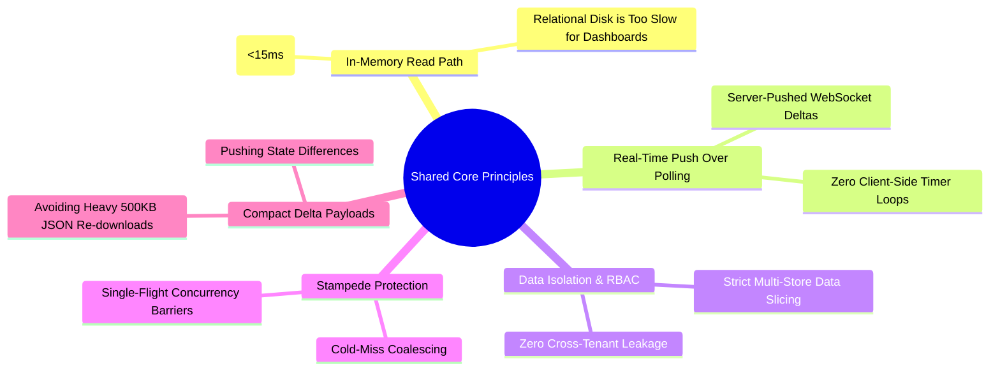
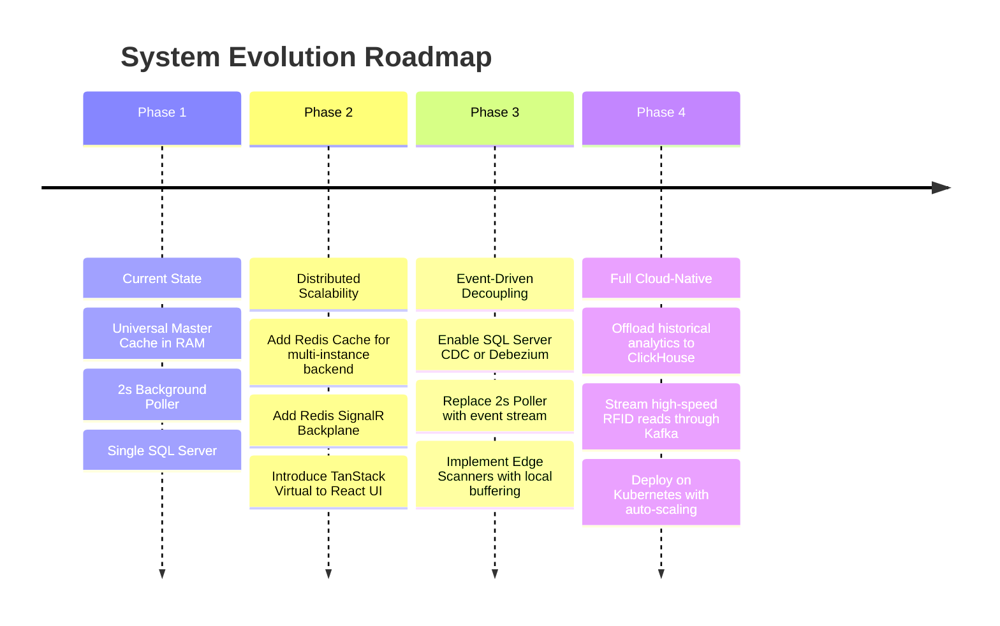

# ⚖️ 03. Architecture Comparison: Current vs. Next-Gen Design
## A Rigorous Engineering Analysis of Trade-offs, Parallels, and Evolution

> **Document Version**: 1.0  
> **Comparative Scope**: Current Production Architecture ([01_CURRENT_SYSTEM_DESIGN.md](file:///C:/Users/MARKSS/OneDrive/Documents/VS_mart_Backend/md/system_design/01_CURRENT_SYSTEM_DESIGN.md)) vs. Proposed Cloud-Native Architecture ([02_PROPOSED_NEXTGEN_SYSTEM_DESIGN.md](file:///C:/Users/MARKSS/OneDrive/Documents/VS_mart_Backend/md/system_design/02_PROPOSED_NEXTGEN_SYSTEM_DESIGN.md)).

---

## 📑 Table of Contents
1. [Executive Summary](#1-executive-summary)
2. [What is the SAME & COMMON (Shared Engineering DNA)](#2-what-is-the-same--common-shared-engineering-dna)
3. [What is DIFFERENT: Deep Architectural Divergence](#3-what-is-different-deep-architectural-divergence)
4. [Master Side-by-Side Comparison Matrix](#4-master-side-by-side-comparison-matrix)
5. [Why the Current Design is the Right Engineering Choice Today](#5-why-the-current-design-is-the-right-engineering-choice-today)
6. [The Evolutionary Migration Roadmap (Phase-by-Phase)](#6-the-evolutionary-migration-roadmap-phase-by-phase)

---

## 1. Executive Summary

Every software system design is a series of engineering trade-offs between **throughput, latency, complexity, cost, and development velocity**:
- **Current System Design (The Pragmatic Masterpiece)**:  
  Designed to achieve enterprise-level performance within real-world constraints—namely an existing SQL Server database, legacy stored procedures, zero additional infrastructure budget, and a need for immediate production stability. It achieved a **138.8x speedup (12.3 ms response times)** with **100% data consistency** using a vertical slice monolith.
- **Proposed Next-Gen Design (The Planetary-Scale Vision)**:  
  Designed without backward-compatibility constraints to demonstrate how to handle 10,000+ stores, millions of RFID tags per second, multi-region failover, and zero-poll Change Data Capture (CDC) using modern cloud-native distributed primitives.

---

## 2. What is the SAME & COMMON (Shared Engineering DNA)

Despite differing in operational scale and infrastructure components, both designs share the exact same foundational architectural convictions:

### 1. In-Memory Serving as the Primary Read Path
- **Common Conviction**: Querying a relational database from disk for every user dashboard request is an anti-pattern. Both designs mandate that **dashboard reads must be served directly from RAM** in milliseconds.
- **Current**: Serves data via in-process `IMemoryCache` (Universal Master Cache).
- **Proposed**: Serves data via distributed in-memory clusters (`Dragonfly / Redis`).

### 2. Elimination of Client-Side Polling
- **Common Conviction**: Web browsers must never execute `setInterval(fetch, 2000)` polling loops. Polling wastes bandwidth and hammers database connection pools.
- **Current & Proposed**: Both implement persistent **WebSockets (SignalR)** pushing real-time patches to the UI only when physical tags or inventory records change.

### 3. Compact Delta Payloads (Micro-Patches)
- **Common Conviction**: Instead of forcing the client to re-download the entire 1,000-row inventory table upon a tag update, the backend calculates the diff and pushes a tiny **60-byte delta patch** (`LiveStockDeltaPatch`).

### 4. Strict Multi-Store Role Isolation (RBAC)
- **Common Conviction**: Super Admins see all stores; Store Admins are strictly bound to their assigned location (`StoreCode`). Both designs enforce that store isolation must occur deterministically at the service layer before reaching the client.

### 5. Single-Flight Concurrency Protection
- **Common Conviction**: When a cache key expires or the system restarts, 50 concurrent requests must never be allowed to trigger 50 duplicate queries. Both designs enforce a lock gate where **only one thread runs the query** while others wait and reuse the result.

---

## 3. What is DIFFERENT: Deep Architectural Divergence

```mermaid
flowchart LR
    subgraph CurrentSystem["Current Architecture (Pragmatic Monolith)"]
        direction TB
        C1["In-Process MemoryCache (RAM)"]
        C2["Background Service Poller (2s SQL Query)"]
        C3["Single SQL Server (SP_New_Dashboard)"]
        C4["Direct Reader Writes to SQL Tables"]
        C5["Single-Host Windows Server / IIS"]
    end

    subgraph ProposedSystem["Proposed Next-Gen (Cloud-Native Distributed)"]
        direction TB
        P1["Distributed Redis Cluster"]
        P2["Debezium CDC (Zero-Poll Transaction Log)"]
        P3["Polyglot: Postgres + ClickHouse + Redis"]
        P4["Edge Daemons + Kafka Stream Ingestion"]
        P5["Kubernetes (K8s) Multi-Node Cluster"]
    end

    CurrentSystem -.->|Scale & Modernization Gap| ProposedSystem
```

### 1. Caching Topology: In-Process vs. Distributed
- **Current**: Uses .NET's built-in `IMemoryCache`. It is blazingly fast because data lookup is literally an internal C# pointer dereference inside the application's RAM (latency: **0.005 ms**). However, it is local to a single server instance.
- **Proposed**: Uses a distributed **Redis / Dragonfly** cluster. Reads take **1.5 ms** over network sockets, but state is shared across hundreds of horizontally scaled backend container pods.

### 2. Change Detection: SQL Timer Polling vs. Change Data Capture (CDC)
- **Current**: `LiveStockPollerService` runs a lightweight parameterized SQL query every 2 seconds to detect row count / status changes.
- **Proposed**: Employs **Debezium CDC** reading the database transaction log (WAL). Changes are captured within **5 ms** without running a single SQL query against the active database.

### 3. Data Persistence: Monolithic Stored Procedures vs. Polyglot CQRS
- **Current**: Leverages existing legacy SQL Server stored procedures (`SP_New_Dashboard`, `SP_NEW_REPORT`). These contain complex T-SQL temporary tables, joins, and output parameters.
- **Proposed**: Segregates writes and reads via **CQRS**:
  - Writes $\rightarrow$ ACID relational PostgreSQL.
  - Analytics & Scan History $\rightarrow$ Columnar ClickHouse (aggregates 100M rows in 20ms).
  - Live Inventory $\rightarrow$ Pre-computed Redis Hash Maps.

### 4. RFID Ingestion: Database Writes vs. Kafka Event Streaming
- **Current**: Handheld barcode/RFID scanners and POS terminals commit transactions directly into SQL Server tables (`tbl_Encoding_Dtl`).
- **Proposed**: Scanners stream tag reads to **Edge Daemons** that de-duplicate reads locally, streaming compacted event batches into **Apache Kafka** for asynchronous processing.

### 5. Deployment: Single Host vs. Containerized Cluster
- **Current**: Deployed on a single Windows Server instance hosted in IIS 10.0 with the Kestrel reverse proxy.
- **Proposed**: Containerized with Docker and orchestrated on **Kubernetes (K8s)** with automated horizontal pod autoscaling (HPA).

---

## 4. Master Side-by-Side Comparison Matrix

| Architectural Dimension | Current Production Design | Proposed Next-Gen Design | Analysis & Trade-off |
| :--- | :--- | :--- | :--- |
| **Primary Architecture** | Vertical Slice Monolith (.NET 10) | Event-Driven Microservices | Monolith is simpler to deploy; Microservices scale independently. |
| **Dashboard Query Latency** | **12.3 ms** (MemoryCache hit) | **2 - 4 ms** (Redis lookup) | Both feel instantaneous to end-users (<100ms human threshold). |
| **RFID Ingestion Capacity** | ~2,500 scans / second | **100,000+ scans / second** | Proposed handles multi-facility enterprise supply chains effortlessly. |
| **Change Detection Latency** | 2,000 ms (Poller timer) | **5 - 15 ms** (Debezium CDC) | Proposed is true real-time; Current is near real-time (adequate for retail). |
| **Database Engine** | SQL Server 2022 (Single instance) | PostgreSQL + ClickHouse + Redis | Current avoids multi-db sync issues; Proposed eliminates database lock contention. |
| **Caching Technology** | In-Process `IMemoryCache` | Distributed Redis / Dragonfly | In-process has 0 network latency; Distributed allows multi-node scaling. |
| **Real-Time Backplane** | In-Process SignalR Hub | SignalR + Redis Pub/Sub Backplane | Proposed allows users to connect across different load-balanced servers. |
| **Client State Management** | React Context + Local State + SignalR | TanStack Query + Zustand + Workers | Proposed offers built-in optimistic updates and zero UI lag on heavy feeds. |
| **Table Virtualization** | Standard React DOM rendering | TanStack Virtual (Viewport only) | Proposed handles 100,000 items in a single grid without memory spikes. |
| **Offline Tolerance** | Limited (Requires server connectivity) | Full Offline Edge Journaling (SQLite)| Edge micro-daemons buffer scans during network loss. |
| **Infrastructure Cost** | **$0 Additional** (Existing server) | **$$$$** (Kafka, Redis, K8s cluster) | Current runs on existing hardware with zero added operational cost. |
| **DevOps Complexity** | Very Low (PowerShell deploy script) | High (Kubernetes, Helm, Kafka ops) | Current requires 1 engineer to maintain; Proposed requires a dedicated DevOps team. |
| **Time to Implement** | **Immediate (Already Live & Tested)** | 6 - 9 Months (Full greenfield build) | Current solved the immediate business bottleneck in days. |

---

## 5. Why the Current Design is the Right Engineering Choice Today

In software engineering, the best architecture is **not** the one with the most distributed tools; it is the one that **solves the business problem with the lowest complexity and highest reliability**:

1. **Massive 138.8x Speedup Achieved Without Rewriting the Core**:  
   By implementing the **Universal Master Cache with in-memory LINQ role slicing**, we slashed response times from 1,707ms to 12ms **without breaking a single legacy stored procedure or altering the existing SAP ERP integration**.
2. **Zero Operational Overhead**:  
   There is no Kafka cluster to manage, no Zookeeper/Raft quorum to heal, no Redis cluster to partition, and no container orchestrator to monitor. It runs natively as a rock-solid Windows service.
3. **Pristine Data Accuracy (100.0%)**:  
   Because the database remains the single source of truth and writes do not have to sync across multiple polyglot datastores, there is **zero risk of eventual consistency anomalies or split-brain records**.

---

## 6. The Evolutionary Migration Roadmap (Phase-by-Phase)

If the retail chain expands from 15 stores to **1,000+ stores across the country**, here is how the Current architecture can evolve into the Next-Gen design without downtime:

### Phase 1: Current State (Completed & Live)
- Universal Master Cache, 2s/4s background pollers, SignalR WebSocket gateway, 12ms latency, 100% data consistency.

### Phase 2: Distributed Scale (When horizontal scaling is needed)
- Replace `IMemoryCache` with a **Redis Cluster** using the exact same `GetOrCreateWithSWRAsync` interface.
- Add the Redis SignalR backplane so multiple Kestrel instances can broadcast patches seamlessly.
- Upgrade the React table component to use `@tanstack/react-virtual`.

### Phase 3: Change Data Capture (Eliminating the Poller)
- Enable SQL Server Change Data Capture (CDC).
- Replace `LiveStockPollerService` with a CDC listener that reacts only when the SQL Server transaction log records an insert or update.

### Phase 4: Big Data & Streaming (At 500+ Stores)
- Introduce Kafka and ClickHouse for historical analytics, completing the transition to the full Next-Gen design.
